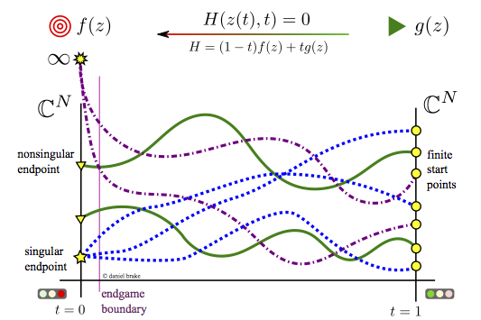

First, some quick links:

- [Wiki](https://github.com/bertiniteam/b2/wiki)
- [Overview](#Overview)
- [Current Capabilites](#Current-capabilites)
- [Installing](#Installing)
- [Other information](#Other-information)

Thanks for checking out Bertini 2!

==

# Overview

The solution of arbitrary polynomial systems is an area of active research, and has many applications in math, science and engineering.  This program, Bertini 2, builds on the success of the first Bertini program, and seeks to eventually replace it entirely, as a powerful numerical engine.

The theoretical basis for the solution of polynomials with Bertini is "homotopy continuation", the act of "continuing" from one system into another through a "homotopy", as depicted in the below diagram.

==

# Current Capabilites

Bertini2 currently has implemented the foundations of Numerical Algebraic Geometry.  Development is ongoing, but here's what we have so far:

- C++ and Python bindings for access into any functionality.
- Construction of polynomial and non-polynomial multivariate systems.
- Evaluation of systems and Jacobians in double and arbitrary multiple precision.
- Construction of the Total Degree start system.
- Construction of homotopies (they're just systems with path variables defined).
- Tracking of a start point x_0, corresponding to a particular time $t_0 \in \mathbb{C}^n$ in a homotopy $H$, from $t_0$ to $t_1$.
- Running of the Power Series and Cauchy endgames.

Development is ongoing, and we want your help!

==

# Installing

### Disclaimer

Bertini 2 is in early development.  Although many of the core capabilities are present, performance needs some serious improvement, and there are probably issues.  That said, you can help us improve Bertini 2 if you try it out.  As of this time (2016.06.03), there is not yet a black box executable in the style of Bertini 1, although there is a parser for the INPUT section of Bertini input files.  

### Supported systems

Supported platforms as of this writing include GNU Linux, Unix, and Mac OSX.  Windows support is promised and upcoming.

### 0. Dependencies

Bertini 2 is written in modern C++, using no few libraries to help us developers focus on the algebraic geometry rather than already-solved problems in C++.  

1. A compiler capable of the C++14 extensions.  GCC 4.9.3 works well, but consumes a lot of memory.  Apple's Clang coming with OSX XCode works well too, but lacks the `thread_local` keyword, so when `./configuring`, you have to disable this feature in the Bertini 2 core.
2. [Boost](http://www.boost.org/).  Minimum version is 1.56.  1.61 will let you compile using expression templates for multiple precision floating point real computations, a valuable optimization.   If you patch Boost.Multiprecision, you can enable them in earlier versions as well.  
3. [Eigen](eigen.tuxfamily.org).  Minimum version is 3.2. The beta of the upcoming version 3.3 currently fails to build.
4.  Current GNU Autotools.  You need libtool, automake, and autoconf.  The default versions of these on most platforms are insufficient, so go get them from your favorite package manager.  Building using CMake is not set up yet, but if you want to set it up for us, please contribute! 

### 1. Download

Either clone (recursive if building python bindings) from [the official repo](https://github.com/bertiniteam/b2), or just download a tarball. 

`git clone https://github.com/bertiniteam/b2 --recursive`

### 2. Compile the core 

The core is the library against which other products will link.  

First, configure.

1. Move to the core `cd b2/core`
2. Configure to compile.  Linux users, first `libtoolize`.  Then `autoreconf -fi` to generate the `./configure` script.  Finally `./configure --your-options`.

Useful configure options:

- `--disable-thread_local`  Mac users will want to use this flag, as Apple's Clang does not implement this C++11 keyword, for whatever reason.  
- `--disable-expression_templates`  Users who want to use Boost versions 1.56-1.60 will want to do this, unless you patch your Boost install.  Patching is easy, and involves only three modifications, and no re-compilation. 

Second, compile.

1. `make` -- Use of multiple threads is suggested, if you have enough memory.  GCC tends to use at least 1GB per thread while compiling Bertini2.  Clang is around 250 MB.
2. `make check` -- Optional but helpful.  This compiles the test suites, runs them, and saves the results to log files.  Currently, several failing tests are present, so expect a few failures.  I promise fully functional test suites expected to 100% pass soon.
3. `make install` -- Install the core to wherever you set prefix to be, typically `/usr/local`.

This is about the end of compilation of the core.  No executable is currently offered, though we expect to have one completed soon (Summer 2016).

### 3. Compile the Python bindings

Again, first configure.

1. Move to the core `cd b2/python`
2. Configure to compile.  Linux users, first `libtoolize`.  Then `autoreconf -fi` to generate the `./configure` script.  Finally `./configure --your-options`.  Remember that you can ask for `--help`.

If you did not clone recursively, you will likely see an error for missing Minieigen files (particularly `minieigen/src/common.hpp`).  The error contains the command you should run to pick up this dependency, `git submodule update --init`.  This should clone Minieigen into `b2/python/minieigen`.

Second, compile.

1. `make` -- Use of multiple threads is again suggested, if you have enough memory.  The Python bindings take even more memory than the core does.
2. `make install` -- Install the bindings to wherever `./configure` determined the place for installed Python modules is.
3. `cd test && python test_all.py` -- Optionally, run the tests.

### 4. Provide feedback

Please help us improve the compiling and installing process by giving feedback, by way of issues on the bertiniteam/b2 repo (preferred), or email to a developer.  Contact info at [the official wiki](https://github.com/bertiniteam/b2/wiki).

==

# Other information

The offical project repository is hosted on GitHub at [https://github.com/bertiniteam/b2](https://github.com/bertiniteam/b2).

Please note that this is a long-term project, and is under active development.  If you want to help, please see [the wiki](https://github.com/bertiniteam/b2/wiki) for contact information.  We have opportinuties for all skill levels and interests.

### License

Bertini 2 is Free and Open Source Software.  Source is available under GPL Version 3, with additional terms as permitted under Section 7.
