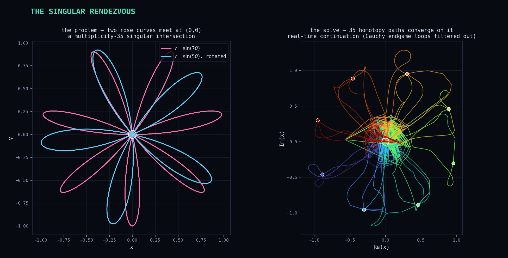
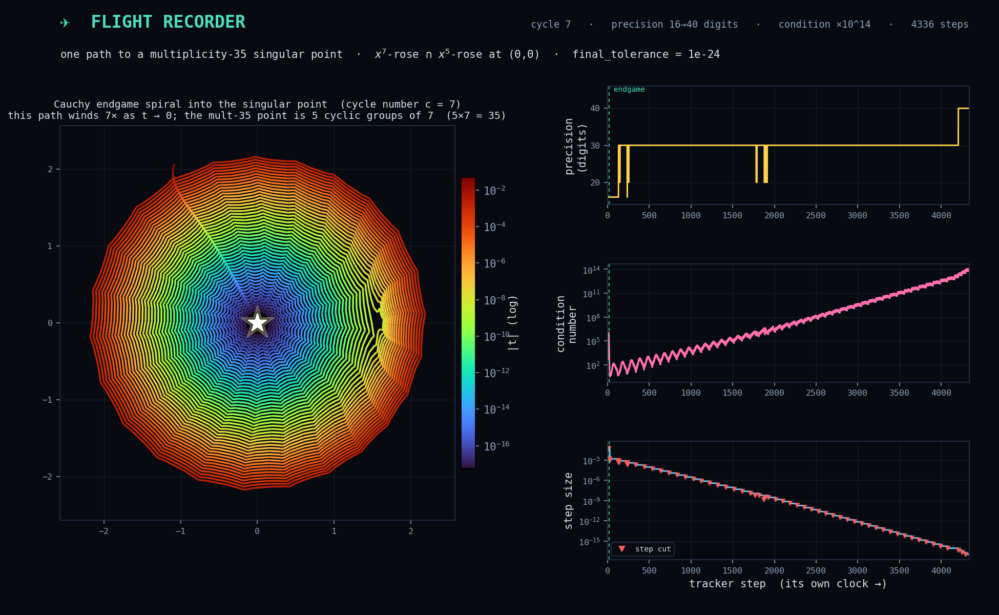

✈️ The Flight Recorder
**********************

Solving is the easy story to tell.  The *hard* story is what the tracker goes through to get
there — and near a badly singular solution it goes through a lot.  The Flight Recorder films one
brutally hard path all the way to a highly singular endpoint and reads out the adaptive-precision
tracker's full telemetry, step by step.

The setup: a singular rendezvous
================================

The subject is the origin :math:`(0,0)`, where two rose curves :math:`r = \sin(7\theta)` and
:math:`r = \sin(5\theta)` (one randomly rotated so their *only* structured coincidence is at the
origin) meet.  That intersection has **multiplicity 35** — thirty-five homotopy paths pile into the
same point — and it is *crankable*: raise the rose degrees or tighten the accuracy demand and the
singularity, and the tracker's struggle, get arbitrarily worse.

On the left is the geometry: two roses whose petals all pass through the origin.  On the right is
the solve — all 35 homotopy paths, each a different colour, wandering out through the complex plane
from their start points and converging on the singular target (the ring).  These are the paths'
*real-time* trajectories: the Cauchy endgame's circular sampling has been filtered out (keep only
the steps where :math:`|t|` reaches a new minimum), leaving the loop-free descent.

.. literalinclude:: flight_recorder.py
   :language: python
   :start-at: def _descent_spine(
   :end-at: return np.append

The Flight Recorder: one path, all instruments
==============================================

Now zoom to a single one of those paths and watch its instruments as it descends.  Here we ask for
very tight final accuracy (``final_tolerance = 1e-24``):

Reading the instruments
=======================

* **The endgame spiral** (left).  The Cauchy endgame samples a circle of shrinking radius around
  the singular endpoint; the solution winds as :math:`t \to 0`, which the log-radial plot unwinds
  into a rose of its own — every tracker step, coloured red (far, :math:`|t|\approx 1`) through to
  violet (:math:`|t|\approx 10^{-16}`, almost there).

* **Precision** (top right) climbs a staircase :math:`16 \to 20 \to 30 \to 40` digits as adaptive
  precision escalates into ``mpfr`` — double precision simply cannot deliver the accuracy the tight
  tolerance demands at this conditioning, so the tracker buys more digits when it must (and, being
  frugal, briefly drops back when it can).

* **The condition number** (middle right) blows up by *fourteen* orders of magnitude as the
  Jacobian degenerates on approach — this is *why* the precision has to climb.

* **The step size** (bottom right) sawtooths downward: grown when the going is easy, **cut** (red
  markers — a rejected step) when the predictor overreaches.  Thousands of ever-smaller steps are
  the price of getting cleanly onto a multiplicity-35 point.

Cycle number is not multiplicity
================================

The spiral is labelled **cycle number 7**, not 35 — a distinction worth pinning down, because it is
a natural thing to trip on.  *Multiplicity* (35) is a property of the **solution**: how many paths
merge there.  The *cycle number* (7) is a property of **one path's endgame**: its winding, so the
solution behaves like :math:`x(t) \sim t^{1/7}` and it takes seven loops of :math:`t` around
:math:`0` to close.  Under that monodromy the 35 paths partition into **cyclic groups** — a group of
size :math:`c` is :math:`c` paths that cyclically permute, each with cycle number :math:`c`.  Ask
the solver and it is exactly consistent: all 35 paths report cycle 7, i.e. **five groups of 7**, and
:math:`5 \times 7 = 35`.  The endgame never has to wind 35 times; it winds 7, because this path
lives in a 7-cycle.

How it is captured
==================

Everything above is real, streamed from the path's own tracker.  Solve with a
:class:`~bertini.SolutionPathCollector` attached (it puts a
:class:`~bertini.tracking.observers.amp.PathDataCollector` on every path's tracker), pick the
singular path that escalates precision the most, and read off its trajectory and its diagnostics —
:math:`|t|`, condition number, precision, and step size at every step:

.. literalinclude:: flight_recorder.py
   :language: python
   :start-at: def record_hard_path(
   :end-at: precision_digits=int(md.precision_digits), accuracy_digits=int(md.accuracy_digits))

The rest is instrument-panel plotting; see ``flight_recorder.py`` in full.

.. note::

   Raster (PNG) showpiece, regenerated through ``tools/refresh_doc_artifacts.py``; not a doctest.
   Run it directly with ``python flight_recorder.py``.  It is deliberately expensive — a tight
   tolerance on a multiplicity-35 point is thousands of tracker steps in escalating precision — so
   it takes appreciably longer than a tutorial figure.
