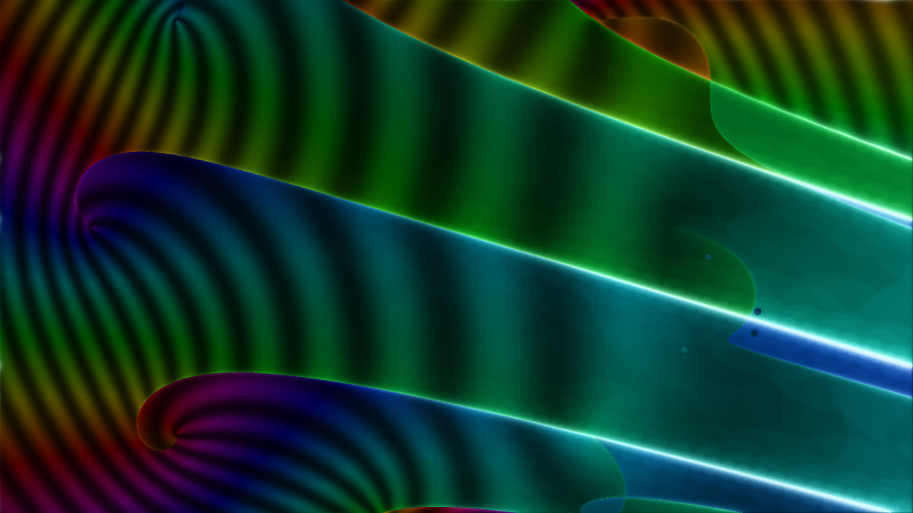
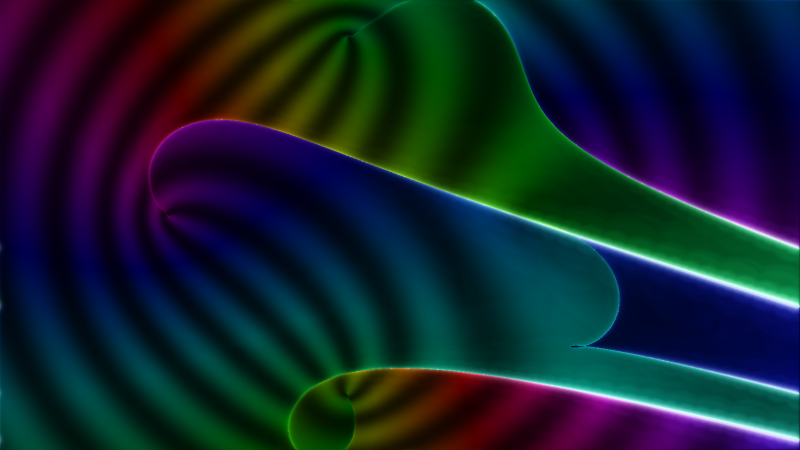

🌀 Homotopy Basins
******************

**Every pixel of this image is a zero-dimensional solve.**  Rasterize a window of the complex
coefficient plane of :math:`f(x;c) = x^9 - 9x - c`; at each pixel, run the genuine total-degree
gamma-trick homotopy

.. math::

   H(x,t) \;=\; \gamma\, t\,(x^9 - 1) \;+\; (1-t)\,(x^9 - 9x - c)

and track all nine start roots from :math:`t=1` to :math:`t=0`.  Nothing below is a synthetic
texture — every channel is tracked data.

         curled roots, striped basins streaming to the right

The **hue** is the phase of the *start–end correlation*
:math:`s(c) = \sum_k \zeta^k x_k(c)` — each path contributes (its start root) × (its landing
point).  The naive unweighted sum of the landings would be permutation-blind (for this family it
is the :math:`x^8` coefficient: identically zero); the start-root weights break that symmetry, so
:math:`s` is holomorphic in :math:`c` inside each basin and *jumps* exactly where the homotopy's
swept discriminant permutes which root each path reaches — swapping the destinations of paths
:math:`j` and :math:`k` kicks it by :math:`(\zeta^j-\zeta^k)(x_j-x_k)`.  The **brightness** is the tracker's own step count — the
blazing arcs are the set of :math:`c` for which the straight-line homotopy passes through a
singular system at some :math:`t`, and the adaptive stepper piles up tiny steps exactly there.
The **stripes** are level bands of :math:`\log|s|` — cosmetic contours of tracked data, not
singularities — and the rainbow whirlpools are the zeros of :math:`s`, where its phase winds.

The gamma trick, photographed
=============================

Why arcs, and why do they all stream the same way?  The family's branch points — the
:math:`c`-values where two roots of :math:`f` collide — form the ring
:math:`c = -8\zeta,\ \zeta^8 = 1`.  The homotopy drags every pixel's system along a straight line
through *system space*, and that line grazes the discriminant along one arc per branch point:

.. math::

   c(\mu) \;=\; -\,\frac{8\,\zeta}{(1+\mu)^{1/8}} \;-\; \mu,
   \qquad \mu = \frac{\gamma\,t}{1-t} \in \gamma\cdot(0,\infty),\quad \zeta^8 = 1,

each arc leaving its branch point and trailing to infinity in the :math:`-\gamma` direction.
That is the **gamma trick** made visible: the arcs are precisely the *bad* target systems for
this choice of :math:`\gamma`, a measure-zero set that a different :math:`\gamma` re-aims
elsewhere — rotate :math:`\gamma` and the whole comet cluster swings around the ring.  For a
generic pixel the paths pass *near* but never *through* the discriminant, and the closer the
brush, the harder the tracker works: the glow you see is `num_total_steps_taken` doing numerical
algebraic geometry the hard way.  The rare white speckle marks pixels where a path genuinely
failed — the gamma trick's measure-zero fine print, caught on camera.

Start simple: five roots, four arcs
===================================

The same construction for :math:`f(x;c) = x^5 - 5x - c` keeps every feature legible: four branch
points at :math:`c = -4\zeta,\ \zeta^4=1`, one glowing arc each, five basins:

Crossing an arc means the straight-line homotopy passed the discriminant on one side rather than
the other, so the destinations of exactly two of the tracked paths trade places — the start–end correlation,
and with it the hue, jumps by the transposition's kick :math:`(\zeta^j-\zeta^k)(x_j-x_k)`.  Walking a small loop *around* an arc's
endpoint (the branch point itself) is precisely the monodromy loop of
:doc:`the Monodromy Loom </showpieces/monodromy_loom/index>` — the two showpieces are the same
mathematics seen from parameter space and from solution space.

How it is built
===============

One exact homotopy per pixel (pixel coordinates are snapped to rationals — every coefficient the
function tree sees is exact, and there is no randomness anywhere, so the tracked data is fully
deterministic):

.. literalinclude:: homotopy_basins.py
   :language: python
   :start-at: def _track_pixel(
   :end-at: return (lands

The rest — the start–end correlation reduction, the stress normalization, the banding and bloom — is
rendering; see ``homotopy_basins.py`` in full.

.. note::

   This is a raster showpiece: PNG only (the image *is* a raster of solves; there is no
   meaningful vector form), regenerated through ``tools/refresh_doc_artifacts.py``.  It is the
   heaviest doc artifact — about 17 million tracked paths across the two frames (roughly 10–15
   minutes on 12 cores).  It is not a doctest — run the generator directly with
   ``python homotopy_basins.py``.
