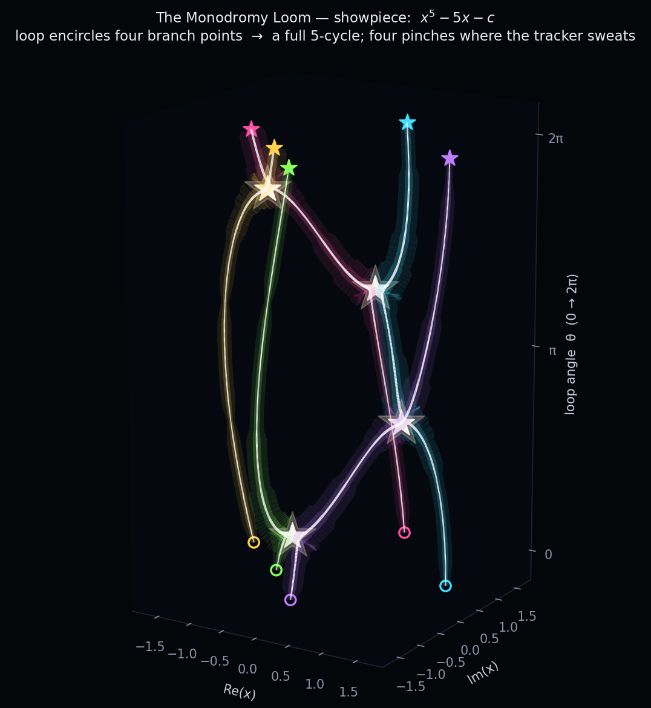
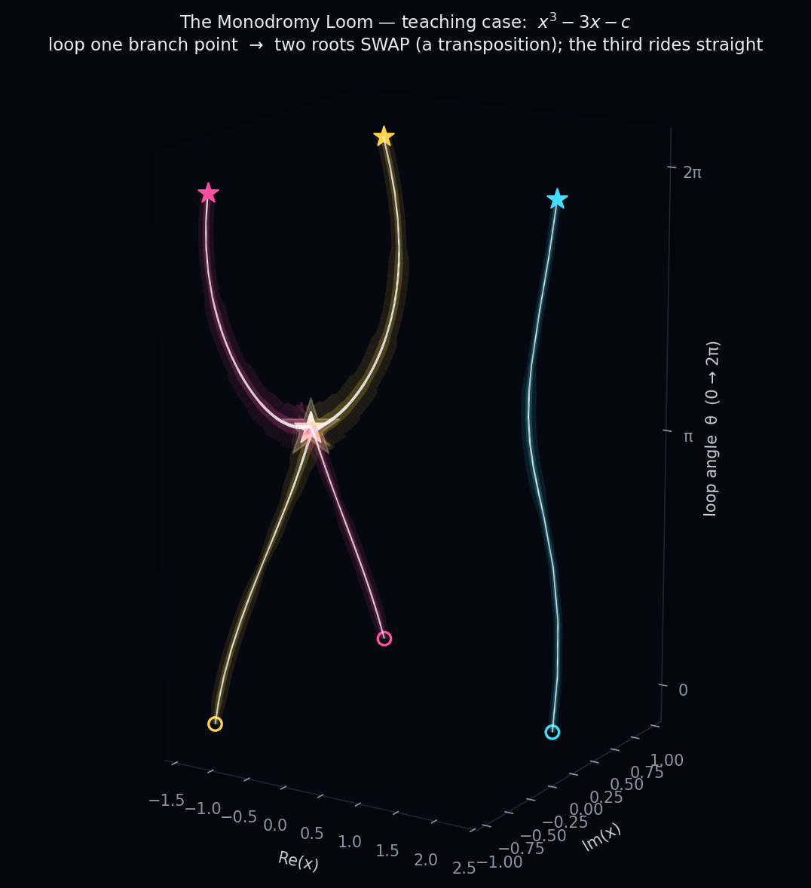

🧬 The Monodromy Loom
*********************

Take a polynomial whose coefficients depend on a parameter, and walk that parameter slowly around
a closed loop.  The roots move as it moves — and when the loop encircles the places where two roots
*collide*, the roots come back **permuted**.  That permutation is the family's **monodromy**: its
Galois action, made visible as a literal braid of tracked solution paths.

Every strand above is one root of :math:`f(x;c) = x^5 - 5x - c`, plotted in 3-D as
:math:`(\operatorname{Re} x,\ \operatorname{Im} x,\ \theta)` where :math:`\theta` is the loop angle
running :math:`0 \to 2\pi`.  As :math:`c` circles once around all four branch points, the five roots
weave through one another and land in a single **5-cycle** — the generator of the family's Galois
group.  The four white star-bursts are the near-collisions: each is where the loop grazes a branch
point and a different pair of strands very nearly touches.

The texture is the tracker's heartbeat
=======================================

The strands are not uniform ribbons.  Their brightness and width are the **adaptive-precision
tracker's own diagnostics**, streamed step-by-step from a
:class:`~bertini.tracking.observers.amp.PathDataCollector`.  Right at a pinch the Jacobian is nearly
singular, so the tracker's step size collapses and it piles up tiny steps to inch past — and exactly
there the strand flares and swells.  You are watching the solver work hardest precisely where the
mathematics is hardest.

Start simple: one loop, one swap
================================

Before the five-strand braid, the whole idea fits in a cubic.  :math:`f(x;c) = x^3 - 3x - c` has two
branch points, at :math:`c = \pm 2`.  Loop **one** of them and exactly two roots swap — a single
transposition — while the third rides straight through, untouched:

The two swapping strands (magenta and gold) cross at the glowing branch point at :math:`\theta=\pi`
— note how they brighten and thicken there as the tracker fights the near-collision — and their
start rings at the base map to each other's end stars at the top.  The calm strand keeps its place.
That is monodromy in one picture; the quintic is the same lesson, louder.

How it is built
===============

The trick is to bake the **entire loop into a single homotopy** by making the coefficient a function
of the path variable, :math:`c(t) = \text{center} + \text{radius}\cdot e^{\,i(\theta + \varphi)}`
with :math:`\theta = 2\pi(1-t)`.  Then one continuous track per strand — from :math:`t=1` (the start
configuration) to :math:`t=0` (the loop closed) — traces the whole loop, and the path variable maps
straight onto the loop angle:

.. literalinclude:: monodromy_loom.py
   :language: python
   :start-at: def loom_homotopy(
   :end-at: return sys

Tracking every strand and capturing its trajectory is then just an
:class:`~bertini.AMPTracker` with a
:class:`~bertini.tracking.observers.amp.PathDataCollector` attached, once per root:

.. literalinclude:: monodromy_loom.py
   :language: python
   :start-at: def track_loop(
   :end-at: return strands, roots

The rest — resampling the strands, colouring by step-size stress, and finding the pinches — is
plotting; see ``monodromy_loom.py`` in full.

Why it matters
==============

The braid is not decoration: it *is* the monodromy representation of the family.  Reading the
permutation off the strands recovers the Galois group of :math:`f(x;c)` over
:math:`\mathbb{C}(c)`, and the same loop-tracking is the engine behind monodromy methods in
numerical algebraic geometry (decomposing solution sets, certifying trace tests).  What makes it
a *showpiece* here is that the picture carries three stories at once — the algebra (the braid), the
geometry (the branch points the strands must wind around), and the numerics (the adaptive tracker
sweating at every collision).

.. note::

   This is a raster showpiece: PNG only (a 3-D render has no meaningful SVG), regenerated through
   ``tools/refresh_doc_artifacts.py``.  It is not a doctest — the code above is shown from the real
   generator, which you can also run directly with ``python monodromy_loom.py``.
