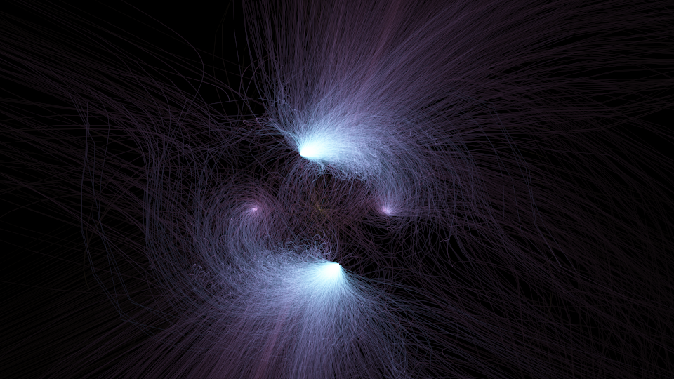
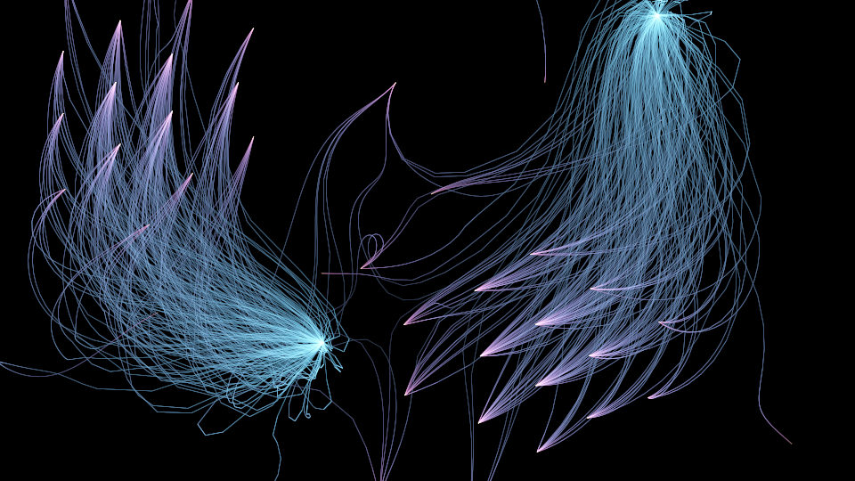

🌌 The Nebula
*************

Every other picture of a solve shows you the **answers**.  This one shows the **journey**: one
zero-dimensional solve, every path, every step, exposed onto a single frame like a long exposure of
a night sky.

Above are all **4096 paths** of a genuine total-degree homotopy for the **Kuramoto model** of seven
coupled oscillators — the equations of *synchronisation*, the thing fireflies do when they flash
together and a power grid does when it locks to one frequency.  Every filament is a tracked path
carrying its solution from the start system to an equilibrium; the two blazing knots are where
whole bundles of them arrive at once.  The solve takes about half a minute and finds **124
equilibria**.

Nothing here is a texture, a gradient, or an artist's impression.  Every photon is tracked data.

Brightness is time
==================

The exposure is meant literally::

    brightness  =  time spent

Between each pair of tracked samples, the tracker spent some amount of path time :math:`|\Delta t|`.
That much *light* is deposited along the segment joining them, spread evenly over its length.  So a
path that crawls burns bright, and a path racing off to infinity leaves a faint comet streak — the
same amount of light, smeared over a much longer trail.

This is why the knots glow.  As :math:`t \to 0` the endgame closes in on a solution, the path slows
almost to a stop, and all of that dwell piles into a few pixels.  You are seeing the solver arrive.

The subtle part is that the light of a segment does **not** depend on how many samples the tracker
chose to leave on it.  Weighting by *step count* would have drawn you a picture of the stepper;
weighting by *path time* draws the path.  Refine the tolerances until the step count doubles and
the picture is unchanged.

Colour is the clock
===================

Colour runs with :math:`\log |t|`: cool where each path starts at :math:`t=1`, through violet, to
white-hot as the endgame closes.  So the frame also reads as a flow — you can see which way time
runs without a single arrow.

A tempting alternative is worth naming as a trap.  The obvious thing is to colour by
:math:`\arg \ell(x)`, the phase of the projection — but the *position* on screen already **is**
:math:`(\operatorname{Re}\ell, \operatorname{Im}\ell)`, so :math:`\arg \ell` is nothing but the
screen's polar angle: a pinwheel that says nothing.  Temperature carries real information, and it
survives the additive blending that a hue wheel would turn to grey.

Start simple: one path, one strand
==================================

Four thousand paths is a cloud.  To see what a cloud is *made of*, here is the same program on a
smaller system — Noonburg's neural-network equations for six neurons, **729 paths** and **717
solutions**, in under three seconds:

Now the strands separate, and the anatomy is plain.  Each filament is **one path**.  They fan out
of the start system, sweep through solution space, and converge — and where they converge they
brighten, because that is where they slow down.  The violet feather-tips are stretches where paths
move fast and their light spreads thin; the cyan cores are where bundles of paths crowd into the
same place and arrive.

Same code, same doctrine, 4096 paths instead of 729, and the strands merge into gas.

What it took to be honest
=========================

Three details are load-bearing, and each was measured rather than assumed:

**The power-series endgame, not Cauchy.**  The Cauchy endgame samples in *circles* around
:math:`t=0`, so :math:`|t|` is deliberately multi-sheeted and a path's data can jump back to the
endgame boundary — which the dwell weighting would draw as a full-frame streak carrying the largest
energy in the picture.  The power-series endgame descends radially instead: measured over 5880
paths, :math:`|t|` is monotone on **every** one, with zero jumps.  (The
:doc:`Flight Recorder </showpieces/flight_recorder/index>` learned the same lesson the hard way.)

**Serial tracking.**  The observer that streams every step is Python, and Python observers
re-acquire the GIL on every event, so twelve threads *convoy*: measured, a threaded solve with the
collector attached is **7× slower** than a serial one.  Threading only wins with no observer.

**Sub-pixel segments.**  Depositing :math:`|\Delta t| / L` per pixel is right until a segment lands
inside a single pixel and :math:`1/L` explodes.  Spreading the same energy over
:math:`\max(1, \lceil L/\Delta \rceil)` subsamples is identical for long segments and simply puts
all the light in one pixel for short ones — no singularity, because the pixel is the sensor and
motion below it is not resolvable.

The code carries a ``--selftest`` that asserts the exposure conserves energy exactly, and a
``--scout`` mode that renders a contact sheet of candidate projections from a single solve, since
tracking is expensive and re-projecting is free.

.. literalinclude:: nebula.py
   :language: python
   :start-at: def track(
   :end-at: return cache

The gallery's three views of one idea
=====================================

The showpieces trace the same machinery at three scales:

* the :doc:`Monodromy Loom </showpieces/monodromy_loom/index>` — **one loop, a few paths**, drawn
  as individual braided strands;
* **the Nebula** — **one solve, every path**, every step;
* Homotopy Basins — **every solve, endpoints only**, a raster of parameter space.

The Loom shows you a strand.  The Nebula shows you the weather.
