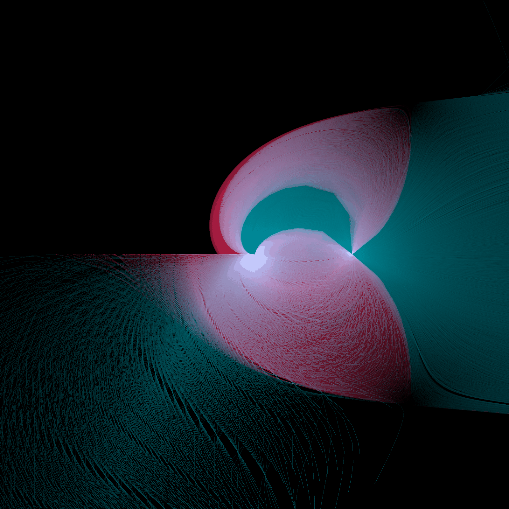
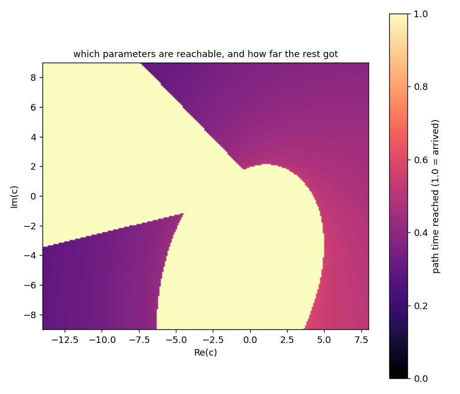

🧵 The Seam
*********************

There is a straight line in this picture, along the negative real axis, and it is not in the
equations.  It is a convention inside a numeric logarithm, and the only reason you can see it is
that thousands of paths died trying to cross it.

         the negative real axis, with bright nodes at 0 and 1

Every stroke is a tracked path: 26,398 that arrived and 21,602 that did not.  For each
parameter :math:`c` on a grid, this tracks

.. math::

   \log x - y = 0, \qquad y^2 - x + c = 0

from the solution :math:`(x, y) = (1, 0)` at :math:`c = 1`, and lays every step of every path
onto one buffer, in :math:`x`.  Teal paths arrived.  Red paths did not.

The second variable *is* the logarithm.  Writing it that way means the tracker **continues** a
logarithm rather than evaluating one: :math:`y` is whatever value follows analytically from where
the path has been, and the equation :math:`\log x = y` asks the implementation whether it agrees.

The line is a choice somebody made
====================================

The logarithm is multivalued.  :math:`\log` of a complex number is only defined up to adding
:math:`2\pi i`, so any implementation must choose a branch, and choosing one means choosing where
to jump.  The usual choice puts the jump on the negative real axis.  That is a convention, not a
theorem; another library could put it somewhere else and be equally correct.

Our equations say nothing about the negative reals.  Neither does the mathematics of this family.
The line is in the picture because the tracker, integrating a function that jumps there, cannot
follow a path across it: the step size collapses, Newton stops converging, and the path stops.
Where it stops is on the seam, and with enough paths the seam draws itself.

Two bright points, and only one of them is real
================================================

The node at :math:`x = 1` is where every path was born.  It is bright because every path starts
there, which is a fact about this render and not about the problem.

The node at :math:`x = 0` is different.  That is the branch point of the logarithm, an honest
feature of the function, the place the cut has to end.  Paths crowd it because the thing they are
continuing genuinely misbehaves there.

The picture shows both, and it is worth being able to tell them apart: one is our staging, one is
the mathematics, and the long straight line between them belongs to neither.

What the dead paths are
=========================

The red is the inside of failed computations, which is the part of this that no amount of care
with a hand-rolled solver would give you.  A solver reports that a path failed.  This library
hands back the path: every step it took, the position at each one, how far along :math:`t` it got
before it stopped, and how small the steps became while it tried.

Those trajectories are what is drawn.  The deaths are not marked with a symbol, they are traced
in full, so the red mass is thousands of complete histories laid over one another, and the sharp
edge is where all of them ran out of room at once.

Look inside the lower lobe and there is a dark curve running through the red.  That is a caustic:
a fold in the family of trajectories, where neighbouring paths stop being neighbours.  It is not
drawn, or detected, or annotated.  It is simply where the paths are not.

Where you can get to at all
=============================

The same sweep, seen in the parameter plane rather than in :math:`x`:

Pale is a parameter that was reached.  Everything else is graded by the path time its path managed
before stalling, which the observer knows because it watched.  The reachable set has a sharp lobe,
a coastline running away to the upper left, and a wedge bitten out of the lower left.

This is a map of what is reachable *by continuation from one starting solution*.  It is not a map
of where solutions exist.  Solutions exist in the dark regions too; they simply cannot be walked
to from here without crossing the seam.

It is not a precision problem
===============================

The obvious suspicion, for anyone who has spent time with numerical software, is that the deaths
are a rounding artifact and more digits would push them away.

They are not.  Tracking the same grid twice, once at double precision and once at eighty digits,
gives the same answer everywhere: in a sample of 799 parameter values, 520 arrived at both
precisions and agreed to within :math:`10^{-6}`, 279 died at both, and **not one** disagreed.
The seam is a discontinuity in the function being evaluated, not a small error in evaluating a
continuous one, and no amount of precision makes a jump smaller.

Which is the honest moral.  Arbitrary precision fixes conditioning.  It does not fix a convention.

Making it
===========

Nothing here is random.  ``gamma`` is the exact rational point :math:`(-24 + 7i)/25` on the unit
circle, from the 7-24-25 triple, and every grid coordinate is an exact rational rather than a
float, so both frames reproduce exactly.  Brightness is **dwell**: each segment deposits the path
time it spans, spread along its length, so refining the stepper does not change the picture.

The paths are collected with a :class:`~bertini.SolutionPathCollector`, one per solve, and the
grid is tracked in parallel.

.. literalinclude:: the_seam.py
   :language: python
   :caption: the_seam.py
