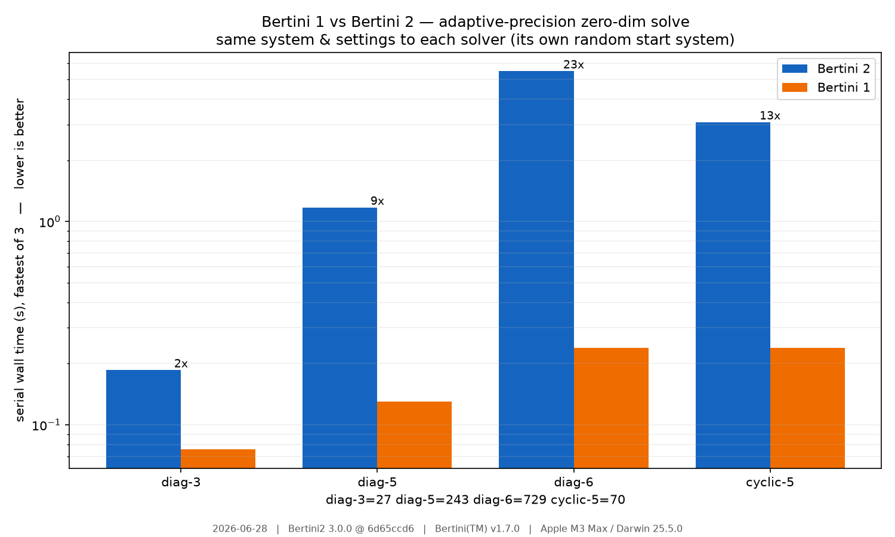

⏱️ Timing Bertini 1 vs Bertini 2
*********************************

Bertini 2 is a from-scratch C++17 rewrite; a fair question is how its speed compares to Bertini 1.7.
This tutorial benchmarks the two on the same systems and ends in a plot — and records *what* was
timed and *where*, so the numbers can be refreshed as the library improves.

Comparing fairly
================

The fair way to compare two solvers is to hand them the **same problem with the same settings**.  We
build each system once in pybertini and emit it as a Bertini-1 classic input with
:py:meth:`System.to_classic_input`, which writes the equations *and* the tracking knobs (precision
mode, predictor, tolerances, step cadence).  Both solvers read that one file, each builds its own
random start system, and solves.  We time only the solver subprocess (never parsing/IO) and keep the
fastest of a few repeats, serial (``OMP_NUM_THREADS=1``):

.. literalinclude:: ../../../examples/b1_vs_b2_timing.py
   :language: python
   :pyobject: time_solver

(The maintained, fuller harness — which also sweeps MPI ranks and appends a committed ``history.csv``
— is ``benchmark/comparison/run_comparison.py``; this tutorial is a small self-contained cousin.)

Record the provenance
=====================

Timing numbers are meaningless without context, and they go stale.  We capture the date, both solver
versions (with the Bertini 2 git commit), and the machine, and stamp them onto the figure:

.. literalinclude:: ../../../examples/b1_vs_b2_timing.py
   :language: python
   :pyobject: provenance

The result
==========

Run it (needs ``matplotlib``; Bertini 1 optional)::

    python python/examples/b1_vs_b2_timing.py \
        --bertini2 ./build/core/bertini2 --bertini1 /usr/local/bin/bertini --out .

How to read it (for the run shown — see the caption for date/versions/machine):

* On these problems Bertini 2 is currently **slower** than Bertini 1 — by ~2× on the tiny diagonal
  system up to ~20× on the larger ones.  This is honest: Bertini 1 is hand-tuned C with its own
  linear algebra; Bertini 2 trades some constant-factor speed for a templated, observable,
  arbitrary-precision design.
* The diagonal family ``diag-3/5/6`` is **well-conditioned** (every path stays in double precision),
  so its growing slowdown is pure **per-step machinery overhead** scaling with problem size — the
  current top performance lever.
* ``cyclic-5`` exercises the endgame; its ratio reflects the adaptive-precision path *after* the
  Criterion-B fix (ADR-0038), which cut this solve from ~11 s to ~3 s.  Re-running this
  tutorial after each performance change is exactly how that progress gets tracked.

Both solvers report the **same solution counts** (shown under the bars), so this is a like-for-like
comparison, not a speed/accuracy trade.
