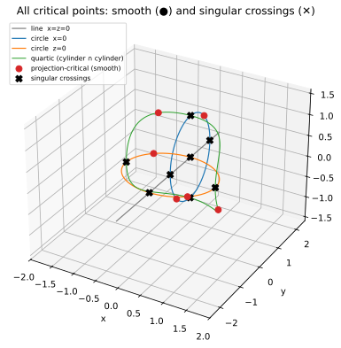
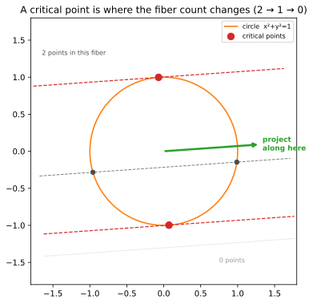

🎯 Critical points by rank deficiency (a null vector, not a determinant)
************************************************************************

.. testsetup:: *

   import bertini

The **critical points** of a curve :math:`f=0` with respect to a linear projection :math:`\pi`
are the points where :math:`\pi` restricted to the curve has vanishing differential -- where
:math:`\pi`'s gradient is orthogonal to the curve's tangent.  They are the building block of much
of numerical algebraic geometry (the witness points of a curve, the branch points of a projection,
the start of a numerical irreducible decomposition).

The naive way to write "the tangent is :math:`\pi`-critical" is a determinant of the Jacobian --
but for a curve in :math:`n` variables that determinant has high degree, and degree is path count.
A **degree-smart** formulation says the same thing without the determinant: the Jacobian of
:math:`f` *stacked with* :math:`\pi`'s coefficient row is **rank-deficient**, i.e. it has a nonzero
null vector.

The rank-deficiency system
==========================

For a space curve cut by :math:`f_1, f_2` in variables :math:`x,y,z`, the :math:`2\times3` Jacobian
:math:`J_f` has rank 2 along the curve, so its kernel is the (1-dimensional) tangent line.  A
linear projection :math:`\pi(x)=\pi_0 x+\pi_1 y+\pi_2 z` is critical exactly when its gradient row
:math:`\pi=(\pi_0,\pi_1,\pi_2)` lies in the row space of :math:`J_f` -- equivalently, the stacked
matrix

.. math::

   M = \begin{bmatrix} J_f \\ \pi \end{bmatrix} \in \mathbb{C}^{3\times 3}

is **rank-deficient**: there is a nonzero :math:`v` with :math:`M v = 0`.  We introduce that null
vector as fresh unknowns :math:`v=(v_0,v_1,v_2)` and add one patch equation :math:`h\cdot v = 1` so
:math:`v\neq 0`.  Counting: :math:`f_1=f_2=0` (2 equations), :math:`Mv=0` (3), the patch (1) -- six
equations in the six unknowns :math:`x,y,z,v_0,v_1,v_2`.  The null vector :math:`v` that comes out
is the curve's tangent direction at the critical point.  Degree stays low (the determinant is never
formed); the cost is three extra variables.

A curve we can check: two interlocking circles
==============================================

.. math::

   f = x\,(x^2+y^2-1), \qquad g = z\,(y^2-2y+z^2).

Each equation is one surface, and their intersection is a (reducible) space curve: :math:`f=0` is
the plane :math:`x=0` together with the cylinder :math:`x^2+y^2=1`; :math:`g=0` is the plane
:math:`z=0` together with the cylinder :math:`(y-1)^2+z^2=1`.  Two of the pieces are interlocking
circles -- :math:`\{x=0,\ (y-1)^2+z^2=1\}` in the :math:`yz`-plane and :math:`\{z=0,\ x^2+y^2=1\}`
in the :math:`xy`-plane -- and a circle has a **predictable** pair of critical points for any
generic projection, which is how we know the answer is right.

(We write the second cylinder expanded, :math:`y^2-2y+z^2`, rather than :math:`(y-1)^2+z^2-1`:
the two are algebraically identical, but a power of a homogenized binomial is not currently
recognized as homogeneous, which the start-system patch needs.)

Building and solving it
=======================

The whole criticality statement is three lines: differentiate the curve into a Jacobian, stack the
random projection's coefficient row on top, and dot the result with a null vector.  ``bertini``
differentiates symbolically (:func:`bertini.jacobian`), :func:`bertini.random_matrix` draws the
random projection (a projection is just a linear functional, so its gradient row *is* a random
coefficient row), and :mod:`bertini.linalg` expresses the linear algebra:

.. testcode::

    import numpy as np
    import bertini
    from bertini import linalg, nag_algorithm

    bertini.random.set_random_seed(2024)
    x, y, z = bertini.Variable('x'), bertini.Variable('y'), bertini.Variable('z')
    f = x * (x**2 + y**2 - 1)
    g = z * (y**2 - 2*y + z**2)

    pi = bertini.random_matrix(1, 3, real=True, orthonormal=False)   # a random real projection row

    J = bertini.jacobian([f, g], [x, y, z])               # 2 x 3 symbolic Jacobian of the curve
    M = np.vstack([J, linalg.as_coefficients(pi)])        # 3 x 3: J_f stacked over the projection
    v = linalg.variable_vector('v', 3)                    # the null-vector unknowns

    sys = bertini.System()
    sys.add(bertini.VariableGroup([x, y, z, *v]), f, g)   # curve equations
    linalg.add_functions(sys, M @ v)                      # M v = 0   (rank deficiency)
    sys.add_function((bertini.random_matrix(1, 3, symbolic=True) @ v)[0] - 1)   # de-zero patch h.v = 1

    solver = nag_algorithm.ZeroDimSolver(sys, endgame='cauchy', mptype='adaptive', startsystem='binomial')
    solver.solve()

    finite = []
    for s in solver.solutions():
        p = np.array(s)
        xyz = (complex(p[0]), complex(p[1]), complex(p[2]))
        if all(abs(w) < 1e6 for w in xyz):
            finite.append(xyz)

Knowing we are right
====================

On the circle :math:`\{x=0,\ (y-1)^2+z^2=1\}` the projection restricts to :math:`\pi_1 y+\pi_2 z`,
extremized at :math:`(0,\ 1\pm \pi_1/r,\ \pm \pi_2/r)` with :math:`r=\sqrt{\pi_1^2+\pi_2^2}`; on
:math:`\{z=0,\ x^2+y^2=1\}` it restricts to :math:`\pi_0 x+\pi_1 y`, extremized at :math:`(\pm
\pi_0/s,\ \pm \pi_1/s,\ 0)` with :math:`s=\sqrt{\pi_0^2+\pi_1^2}`.  All four predicted points turn
up among the solutions:

.. testcode::

    a, b, c = (complex(e).real for e in pi.ravel())
    r, s = np.hypot(b, c), np.hypot(a, b)
    predicted = [(0, 1 + b/r, c/r), (0, 1 - b/r, -c/r), (a/s, b/s, 0), (-a/s, -b/s, 0)]

    def recovered(q):
        return any(max(abs(w.real - t) + abs(w.imag) for w, t in zip(sol, q)) < 1e-5 for sol in finite)

    assert all(recovered(q) for q in predicted)            # the two critical points on each circle

Plotting the curve, the projection, and where the critical points land
=====================================================================

A projection :math:`\pi` is "look at the curve along the direction :math:`\pi` and read off the
coordinate :math:`\pi\cdot x`."  Picture that as an **axis** in the direction of :math:`\pi`: every
point of the curve drops onto it, and the **critical points are exactly the ones whose image stops
moving** -- the nearest and farthest landing spots on each circle.  We draw the two circles, the
:math:`\pi` direction, the projection axis, and a segment from each critical point to the spot it
lands on:

.. testcode::

    import matplotlib.pyplot as plt

    u = np.array([a, b, c]); u = u / np.linalg.norm(u)        # unit projection direction
    crit = np.array([(q[0].real if hasattr(q[0], 'real') else q[0],
                      q[1], q[2]) for q in predicted], dtype=float)
    feet = np.outer(crit @ u, u)                              # where each critical point lands on the axis
    ts = crit @ u
    axis = np.outer(np.linspace(ts.min() - 0.4, ts.max() + 0.4, 2), u)

    th = np.linspace(0, 2*np.pi, 400)
    fig = plt.figure(figsize=(7, 6))
    ax = fig.add_subplot(projection='3d')
    ax.plot(np.zeros_like(th), 1 + np.cos(th), np.sin(th), 'C0', lw=1.2, label='circle in x=0')  # the curve
    ax.plot(np.cos(th), np.sin(th), np.zeros_like(th), 'C1', lw=1.2, label='circle in z=0')
    ax.scatter(crit[:, 0], crit[:, 1], crit[:, 2], c='C3', s=45, depthshade=False, label='critical points')
    ax.plot(axis[:, 0], axis[:, 1], axis[:, 2], 'k--', lw=1, label='projection axis (direction π)')
    ax.scatter(feet[:, 0], feet[:, 1], feet[:, 2], c='k', s=20)                 # the landing spots
    for i, (P, Ft) in enumerate(zip(crit, feet)):                                # each critical point's fiber
        ax.plot([P[0], Ft[0]], [P[1], Ft[1]], [P[2], Ft[2]], color='0.5', lw=0.9, ls='--',
                label='projection fibers' if i == 0 else None)
    ax.quiver(0, 0, 0, u[0], u[1], u[2], length=1.2, color='C2', lw=2, label='π direction')
    ax.set_xlabel('x'); ax.set_ylabel('y'); ax.set_zlabel('z')
    ax.legend(loc='upper left', fontsize=8)
    ax.set_title('Projection-critical points of two interlocking circles')
    plt.show()

   The two interlocking circles (the curve), the projection direction :math:`\pi` (green arrow),
   and a representative projection axis along :math:`\pi` (black dashed).  Each red critical point
   is joined to its landing spot on the axis by a dashed **fiber** (a level set of :math:`\pi`);
   these are the extreme landing spots, where the image :math:`\pi\cdot x` stops moving as you
   travel along a circle.

What a critical point *is*: where the fiber count jumps
======================================================

There is a more illuminating way to read these points than "the tangent is :math:`\pi`-critical" --
one that makes even the two points on the orange circle obvious.  A projection has **fibers**: the
preimages :math:`\pi^{-1}(c)`, one level set per value :math:`c`.  Sweep :math:`c` and count how
many points of the curve sit in the fiber.  For the orange circle :math:`x^2+y^2=1` a generic fiber
meets it in **two** points; push :math:`c` to an extreme and those two **collide into one** (the
fiber becomes tangent); push past it and there are **none**.  The values where the count changes --
:math:`2 \to 1 \to 0` -- are exactly the **critical points**.  They are the *branch points* of the
projection, where the sheets of :math:`\pi^{-1}` come together:

   The orange circle seen along :math:`\pi`.  A generic fiber (grey) meets it in two points; the
   two critical fibers (red, tangent) meet it in one -- the two collide -- and a fiber past them
   (dotted) meets it in none.  The critical points are precisely where the fiber count jumps.

This is why the count of critical points is a genuine invariant of the curve-and-projection, and
why criticality is the workhorse it is: branch points organize how a curve sits over its image.

The recipe needs nothing special of the curve: differentiate *your* :math:`f` into a Jacobian,
stack a random projection row, dot with a null vector, patch it, and solve.
