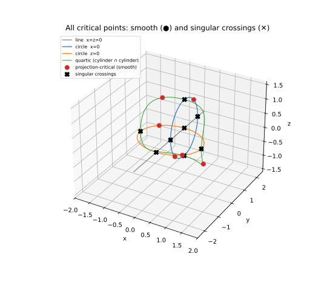
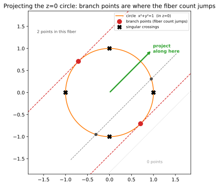

🎯 Critical points by rank deficiency (a null vector, not a determinant)
************************************************************************

.. testsetup:: *

   import bertini

The **critical points** of a curve :math:`f=0` with respect to a linear projection :math:`\pi`
are the points where :math:`\pi` restricted to the curve has vanishing differential -- where
:math:`\pi`'s gradient is orthogonal to the curve's tangent.  They are the building block of much
of numerical algebraic geometry (the branch points of a projection, the witness points of a curve,
the start of a numerical irreducible decomposition).

The naive way to write "the tangent is :math:`\pi`-critical" is a determinant of the Jacobian --
but for a curve in :math:`n` variables that determinant has high degree, and degree is path count.
A **degree-smart** formulation says the same thing without the determinant: the Jacobian of
:math:`f` *stacked with* :math:`\pi`'s coefficient row is **rank-deficient**, i.e. it has a nonzero
null vector.

The rank-deficiency system
==========================

For a space curve cut by :math:`f_1, f_2` in variables :math:`x,y,z`, the :math:`2\times3` Jacobian
:math:`J_f` has rank 2 where the curve is smooth, so its kernel is the (1-dimensional) tangent
line.  A linear projection :math:`\pi(x)=\pi_0 x+\pi_1 y+\pi_2 z` is critical exactly when its
gradient row :math:`\pi=(\pi_0,\pi_1,\pi_2)` lies in the row space of :math:`J_f` -- equivalently,
the stacked matrix

.. math::

   M = \begin{bmatrix} J_f \\ \pi \end{bmatrix} \in \mathbb{C}^{3\times 3}

is **rank-deficient**: there is a nonzero :math:`v` with :math:`M v = 0`.  We introduce that null
vector as fresh unknowns :math:`v=(v_0,v_1,v_2)` and add one patch equation :math:`h\cdot v = 1` so
:math:`v\neq 0`.  Counting: :math:`f_1=f_2=0` (2 equations), :math:`Mv=0` (3), the patch (1) -- six
equations in the six unknowns :math:`x,y,z,v_0,v_1,v_2`.  The null vector :math:`v` that comes out
is the curve's tangent direction at a smooth critical point.  Degree stays low (the determinant is
never formed); the cost is three extra variables.

The curve (which is more than it looks)
=======================================

.. math::

   f = x\,(x^2+y^2-1), \qquad g = z\,\bigl((y-1)^2+z^2-1\bigr).

Each equation is one surface, and their intersection is a **reducible** space curve.  :math:`f=0`
is the plane :math:`x=0` together with the cylinder :math:`x^2+y^2=1`; :math:`g=0` is the plane
:math:`z=0` together with the cylinder :math:`(y-1)^2+z^2=1`.  Multiplying out the four
plane/cylinder pairs, the curve is (by Bézout, total degree :math:`3\cdot 3 = 9`):

* a **line**, the :math:`y`-axis :math:`\{x=0,\ z=0\}` (degree 1),
* **two interlocking circles** -- :math:`\{x=0,\ (y-1)^2+z^2=1\}` in the :math:`yz`-plane and
  :math:`\{z=0,\ x^2+y^2=1\}` in the :math:`xy`-plane (degree 2 each),
* a **quartic** where the two cylinders meet, :math:`\{x^2+y^2=1,\ (y-1)^2+z^2=1\}` (degree 4).

:math:`1+2+2+4=9`.  We are **not** decomposing the curve here (that is numerical irreducible
decomposition, a different algorithm) -- we just want its critical points.  But the reducibility
matters: the components cross each other, and those crossings are singular points of the curve,
which the criticality system will pick up alongside the honest projection-critical points.

Building and solving it
=======================

The whole criticality statement is three lines: differentiate the curve into a Jacobian, stack the
random projection's coefficient row on top, and dot the result with a null vector.  ``bertini``
differentiates symbolically (:func:`bertini.jacobian`), :func:`bertini.random_matrix` draws the
random projection (a projection is just a linear functional, so its gradient row *is* a random
coefficient row), and ``bertini`` expresses the linear algebra:

.. testcode::

    import numpy as np
    import bertini

    bertini.random.set_random_seed(165)
    x, y, z = bertini.Variable('x'), bertini.Variable('y'), bertini.Variable('z')
    f = x * (x**2 + y**2 - 1)
    g = z * ((y - 1)**2 + z**2 - 1)

    pi = bertini.random_matrix(1, 3, real=True, orthonormal=False)   # a random real projection row

    J = bertini.jacobian([f, g], [x, y, z])               # 2 x 3 symbolic Jacobian of the curve
    M = np.vstack([J, bertini.coefficients(pi)])          # 3 x 3: J_f stacked over the projection
    v = np.array(bertini.variables('v', 3), dtype=object) # the null-vector unknowns

    sys = bertini.System()
    sys.add(bertini.VariableGroup([x, y, z, *v]), f, g)   # curve equations
    sys.add_functions(M @ v)                              # M v = 0   (rank deficiency)
    sys.add_function((bertini.random_matrix(1, 3, symbolic=True) @ v)[0] - 1)   # de-zero patch h.v = 1

    solver = bertini.ZeroDimSolver(sys, endgame='cauchy', mptype='adaptive', startsystem='binomial')
    solver.solve()

    finite = []
    for s in solver.solutions():
        p = np.array(s)
        xyz = (complex(p[0]), complex(p[1]), complex(p[2]))
        if all(abs(w) < 1e6 for w in xyz):
            finite.append(xyz)

Knowing we are right
====================

Each circle is a genus-0 degree-2 curve, so it has a **predictable** pair of critical points for
any generic projection.  On :math:`\{x=0,\ (y-1)^2+z^2=1\}` the projection restricts to
:math:`\pi_1 y+\pi_2 z`, extremized at :math:`(0,\ 1\pm \pi_1/r,\ \pm \pi_2/r)` with
:math:`r=\sqrt{\pi_1^2+\pi_2^2}`; on :math:`\{z=0,\ x^2+y^2=1\}` it restricts to
:math:`\pi_0 x+\pi_1 y`, extremized at :math:`(\pm \pi_0/s,\ \pm \pi_1/s,\ 0)` with
:math:`s=\sqrt{\pi_0^2+\pi_1^2}`.  These four are only a *subset* of the critical points, but they
are ones we can write down, so they are our check -- all four turn up among the solutions:

.. testcode::

    a, b, c = (complex(e).real for e in pi.ravel())
    r, s = np.hypot(b, c), np.hypot(a, b)
    predicted = [(0, 1 + b/r, c/r), (0, 1 - b/r, -c/r), (a/s, b/s, 0), (-a/s, -b/s, 0)]

    def recovered(q):
        return any(max(abs(w.real - t) + abs(w.imag) for w, t in zip(sol, q)) < 1e-5 for sol in finite)

    assert all(recovered(q) for q in predicted)            # the two critical points on each circle

Two kinds of critical point
===========================

The solve returns more than those four, and honesty demands we show them all.  The real critical
points come in two flavours:

* **smooth projection-critical points** -- on a *single* component where the curve is smooth, the
  genuine "the projection stops moving" points (two on each circle, and some on the quartic);
* **singular crossings** -- where two components meet (line-meets-circle, circle-meets-quartic), the
  curve is *not* smooth, so :math:`J_f` is already rank-deficient there and the point satisfies the
  system automatically.

We label each real solution by how many of the four components pass through it, and plot the whole
curve so nothing is hidden:

.. testcode::

    import matplotlib.pyplot as plt

    reals = [np.array([w.real for w in p]) for p in finite if all(abs(w.imag) < 1e-7 for w in p)]
    uniq = []
    for p in reals:
        if not any(np.linalg.norm(p - q) < 1e-4 for q in uniq):
            uniq.append(p)

    def n_components(p):                                   # how many components pass through p
        X, Y, Z = p; e = 1e-5
        return sum([abs(X) < e and abs(Z) < e,                                   # line  x=z=0
                    abs(X) < e and abs((Y - 1)**2 + Z**2 - 1) < e,               # circle  x=0
                    abs(Z) < e and abs(X**2 + Y**2 - 1) < e,                     # circle  z=0
                    abs(X**2 + Y**2 - 1) < e and abs((Y - 1)**2 + Z**2 - 1) < e])# quartic

    smooth   = np.array([p for p in uniq if n_components(p) == 1])
    singular = np.array([p for p in uniq if n_components(p) >= 2])

    t = np.linspace(0, 2*np.pi, 400); tt = np.linspace(0, np.pi, 300)
    fig = plt.figure(figsize=(7.5, 6.5)); ax = fig.add_subplot(projection='3d')
    ax.plot([0, 0], [-2.5, 2.5], [0, 0], color='0.5', lw=1.2, label='line  x=z=0')
    ax.plot(np.zeros_like(t), 1 + np.cos(t), np.sin(t), 'C0', lw=1.2, label='circle  x=0')
    ax.plot(np.cos(t), np.sin(t), np.zeros_like(t), 'C1', lw=1.2, label='circle  z=0')
    for sgn in (1, -1):                                    # quartic: two z-branches
        ax.plot(np.cos(tt), np.sin(tt), sgn*np.sqrt(np.clip(np.sin(tt)*(2 - np.sin(tt)), 0, None)),
                'C2', lw=1.0, label='quartic (cylinder ∩ cylinder)' if sgn == 1 else None)
    ax.scatter(smooth[:, 0], smooth[:, 1], smooth[:, 2], c='C3', s=48, depthshade=False,
               label='projection-critical (smooth)')
    ax.scatter(singular[:, 0], singular[:, 1], singular[:, 2], marker='X', c='k', s=55,
               depthshade=False, label='singular crossings')
    ax.set_xlabel('x'); ax.set_ylabel('y'); ax.set_zlabel('z')
    ax.set_xlim(-2, 2); ax.set_ylim(-2.5, 2.5); ax.set_zlim(-1.6, 1.6)
    ax.legend(loc='upper left', fontsize=7.5)
    ax.set_title('All critical points: smooth (●) and singular crossings (✕)')
    plt.show()

   The full reducible curve -- the :math:`y`-axis line, the two interlocking circles, and the
   quartic where the cylinders meet -- with every real critical point: the smooth
   projection-critical points (●) and the singular crossings (✕) where components meet.

What a smooth critical point *is*: where the fiber count jumps
==============================================================

For the smooth points there is an illuminating reading.  A projection reads off the coordinate
:math:`\pi\cdot x`; its **fibers** are the level sets, and you *project along* them (the projection
direction is parallel to the fibers, perpendicular to the gradient :math:`\pi`, which points along
the image axis).  Sweep the projection value and count how many points of a component sit in the
fiber.  For the :math:`z=0` circle a generic fiber meets it in **two** points; push to an extreme
and those two **collide into one** (the fiber goes tangent); push past and there are **none**.  The
values where the count changes -- :math:`2\to 1\to 0` -- are exactly the smooth critical points.
They are the *branch points* of the projection:

   The :math:`z=0` circle, projected along the green direction (fibers = the parallel dashed
   lines).  A generic fiber (grey) meets it in two points; the two critical fibers (red, tangent)
   meet it in one -- the two collide -- and a fiber past them (dotted) meets it in none.  The two
   red **branch points** are where the fiber count jumps; the black ✕ mark where the line and the
   quartic cross this circle (singular points of the whole curve, not branch points of the circle).

The recipe needs nothing special of the curve: differentiate *your* :math:`f` into a Jacobian,
stack a random projection row, dot with a null vector, patch it, and solve.  What comes back is
every critical point -- and, on the smooth pieces, every branch point of the projection.

Complete example
================

The full runnable script -- assemble nothing, just run it:

.. literalinclude:: critical_points.py
   :language: python
   :caption: critical_points.py
