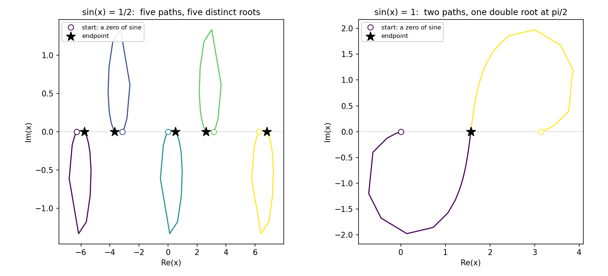

〰️ Tracking an analytic homotopy
**********************************************

.. testsetup:: *

   import bertini
   import numpy as np
   _saved_precision = bertini.default_precision()
   bertini.default_precision(60)

.. testcleanup:: *

   bertini.default_precision(_saved_precision)

The :doc:`previous tutorial <../tracking_nonsingular/index>` pauses
partway through to add a sine to a system, observes that its degree comes back as ``-1``, remarks
that homotopy continuation on non-algebraic systems is possible anyway, and then deletes the
system and goes back to polynomials.

This page is the part it skipped.

Why there is no start system
==============================

A start system exists to be solved without effort, and to have enough roots to reach every
solution of the target.  Both halves lean on the degree.  A total-degree start system is built
from the degrees of the target's functions, and the number of paths it provides is their product.

Sine has no degree.  Ask, and Bertini tells you so:

.. testcode::

    x = bertini.Variable('x')
    trouble = bertini.System()
    trouble.add_variable_group(bertini.VariableGroup([x]))
    trouble.add_function(bertini.symbolics.sin(x) - bertini.coefficient('1/2'))

    print(list(trouble.degrees()))
    print(trouble.is_polynomial())

.. testoutput::

    [-1]
    False

That is not an evasion, it is the truth: ``sin(x) = 1/2`` has infinitely many solutions, and no
finite number of paths could reach them all.  Asking for a start system says so out loud.

.. testcode::

    try:
        bertini.system.start_system.TotalDegreeLinearProduct(trouble)
    except RuntimeError as refused:
        print('refused')

.. testoutput::

    refused

But path tracking never needed a start system.  It needs a homotopy and some points to start
from.  Supply those two things and everything else in the library works unchanged.

A homotopy with sine in it
============================

Build the two ends as ordinary systems and glue them together.  At :math:`t = 1` the homotopy is
``gamma*sin(x)``, whose roots are the integer multiples of :math:`\pi`; at :math:`t = 0` it is the
target.

.. testcode::

    target = bertini.System()
    target.add_variable_group(bertini.VariableGroup([x]))
    target.add_function(bertini.symbolics.sin(x) - bertini.coefficient('1/2'))

    start = bertini.System()
    start.add_variable_group(bertini.VariableGroup([x]))
    start.add_function(bertini.symbolics.sin(x))

    gamma = bertini.coefficient('-24/25') + bertini.I * bertini.coefficient('7/25')
    H = bertini.system.make_homotopy(target, start, gamma=gamma)

    print(H.have_path_variable(), H.num_functions(), list(H.degrees()))

.. testoutput::

    True 1 [-1]

``print(H)`` shows what was built:

.. code-block:: text

    1 variable group:
      group 0: x

    1 function:
      f_0 = (sin(x)-1/2)*(1-t)+((0+1*I)*7/25+(-24/25))*t*sin(x)

    path variable: t

The homotopy inherits the ``-1``: a blend of functions is polynomial only when every part is.

That ``gamma`` is the exact rational point :math:`(-24 + 7i)/25` on the unit circle, from the
Pythagorean triple 7-24-25.  A random gamma would do the same job; an exact one makes this page
reproduce byte for byte.  Keeping coefficients exact matters more than usual here, because a
decimal string becomes a binary float and any noise in a coefficient moves the singularity
structure you are about to look at.

You choose the window
=======================

Here is the part with no polynomial analogue.  Nobody can hand you all the solutions, so you
decide which ones you want by choosing where to start.  Five multiples of :math:`\pi` will chase
five roots.

.. testcode::

    pi = bertini.multiprec.real_mp('3.14159265358979323846264338327950288419716939937511')
    start_points = [np.array([bertini.multiprec.complex_mp(pi * k)]) for k in (-2, -1, 0, 1, 2)]

Want more roots?  Start from more multiples.  The count is yours, not the system's.

Tracking, at a precision you pick
===================================

.. testcode::

    solver = bertini.HomotopySolver(H, start_points, target, mptype='multiple')
    solver.solve()

    ends = sorted(round(complex(s[0]).real, 9) for s in solver.all_solutions())
    print(ends)

.. testoutput::

    [-5.759586532, -3.665191429, 0.523598776, 2.617993878, 6.806784083]

Every one of those is a root of :math:`\sin x = 1/2`, which the closed form puts at
:math:`\arcsin(1/2) + 2\pi k` and :math:`\pi - \arcsin(1/2) + 2\pi k`.  Checking against it:

.. testcode::

    exact = [np.arcsin(0.5) + 2 * np.pi * k for k in (-1, 0, 1)] + \
            [np.pi - np.arcsin(0.5) + 2 * np.pi * k for k in (-1, 0, 1)]
    worst = max(min(abs(e - w) for w in exact) for e in ends)
    print(worst < 1e-9)

.. testoutput::

    True

Five starts, five distinct roots, each correct to the tolerance we asked for.

Why the precision model is not the default one
================================================

``mptype='multiple'`` above was not an accident.  Ask for the default, adaptive precision, and
Bertini declines:

.. testcode::

    try:
        bertini.HomotopySolver(H, start_points, target, mptype='adaptive')
    except ValueError as refused:
        print(str(refused).split('.')[0])

.. testoutput::

    HomotopySolver: this homotopy is not polynomial, and adaptive precision needs a degree bound it therefore cannot have

Adaptive precision decides how many digits a step needs by comparing measured quantities against
two error bounds, one for evaluating the functions and one for evaluating the Jacobian.  For a
polynomial system those bounds come from its degree and the size of its coefficients.  With no
degree there is no such recipe, and the criteria have nothing to compare against.

Fixed precision carries no such constants, which is why it just works.  Choose enough digits for
the problem and the tracker does the rest.

If you want adaptive precision anyway, you supply the two bounds yourself, and the solver takes
them:

.. testcode::

    config = bertini.tracking.AMPConfig()
    config.jacobian_eval_error_bound = 8
    config.function_eval_error_bound = 4
    config.linear_solve_error_bound = 1

    adaptive = bertini.HomotopySolver(H, start_points, target,
                                      mptype='adaptive', amp_config=config)
    adaptive.solve()
    print(len(adaptive.all_solutions()))

.. testoutput::

    5

Numbers you can defend for your own system, that is.  What those bounds *should* be for an
analytic system is a genuinely open question, and the reading is gathered in `issue 439
<https://github.com/bertiniteam/b2/issues/439>`_.

The endgame still knows what it is doing
==========================================

Push the right-hand side to 1 and the roots collide: :math:`\sin x = 1` has a double root at
:math:`\pi/2`.  This is where you might expect the machinery to give up, since the endgame's
theory is usually stated for polynomials.

.. testcode::

    hard_target = bertini.System()
    hard_target.add_variable_group(bertini.VariableGroup([x]))
    hard_target.add_function(bertini.symbolics.sin(x) - bertini.coefficient(1))

    hard = bertini.system.make_homotopy(hard_target, start, gamma=gamma)
    two = [np.array([bertini.multiprec.complex_mp(pi * k)]) for k in (0, 1)]

    collide = bertini.HomotopySolver(hard, two, hard_target, mptype='multiple')
    collide.solve()

    print([m.cycle_num for m in collide.solution_metadata()])
    print([round(complex(s[0]).real, 6) for s in collide.all_solutions()])

.. testoutput::

    [2, 2]
    [1.570796, 1.570796]

Cycle number 2, correctly, and both paths land on :math:`\pi/2`.

It works for a reason worth knowing.  The power series endgame assumes the path behaves like a
Puiseux series near its endpoint, which is a statement about algebraic branching.  Weierstrass
preparation says that an analytic function with an isolated zero of order :math:`k` factors
locally as a unit times a polynomial of degree :math:`k`.  So near a finite endpoint an analytic
family branches exactly like an algebraic one, and the endgame's assumption survives.  Nothing in
the cycle-number estimate consults a degree either: it works from the spacing of the samples it
took.

Two pictures
==============

         roots of sin(x) = 1/2.  Right, two paths converging on pi/2 from opposite sides.
   :align: center

   Both frames are real tracked data.  Open circles are the zeros of sine we chose to start from,
   stars are the endpoints, and each vertex is a step the tracker actually took.  On the left,
   five paths leave the real axis, loop through the complex plane and return to five distinct
   roots.  On the right, the two paths approach :math:`\pi/2` from opposite sides and arrive
   together: the picture of a branch point, and of the cycle number 2 the endgame reported.

What you do not get
=====================

Worth being plain about the limits, since they are real and they are not bugs.

There is no solution count.  No Bezout number bounds an analytic system, so "all solutions" is
not a question this machinery answers.  You get the endpoints of the paths you started.

There is no completeness guarantee.  Choosing more start points finds more roots, and nothing
tells you when to stop.

Paths that run to infinity have no theory behind them here.  For a polynomial system, divergence
is understood through the degree and projective space.  An exponential has an essential
singularity at infinity, and the usual reasoning does not transfer.  Tracking such a path is not
forbidden; just do not expect the diverging-path heuristics to mean what they mean for a
polynomial.

Adaptive precision needs bounds you chose, as above.

The source
============

.. literalinclude:: tracking_analytic.py
   :language: python
   :caption: tracking_analytic.py
