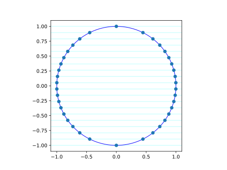

🔁 Parameter homotopy
**********************************************************

.. testsetup:: *

   import bertini
   _docs_ambient = bertini.records_dir()   # restored in testcleanup

.. testcleanup:: *

   import shutil
   shutil.rmtree("circle_sweep_records", ignore_errors=True)
   bertini.records_dir(_docs_ambient)

The most expensive part of homotopy continuation is the *first* solve -- the one that has to
find every solution from scratch.  But a great many problems are really a **family** of systems
that differ only in their coefficients: the same equations, evaluated at different parameter
values.  The eigenvalues of :math:`A(s)` as :math:`s` varies; the intersections of a fixed curve
with a moving line; a design swept across a range of settings.

For such a family you should solve **once**, at generic complex parameter values, and then **reuse** those
solutions as the start points of a *parameter homotopy* that deforms the coefficients to whatever
value you actually care about -- as many times as you like, each move tracking just the solutions
you already have.  

The tools are :func:`bertini.nag_algorithm.straight_line_homotopy` (builds the homotopy)
and :func:`bertini.HomotopySolver` (runs the full zero-dim pipeline -- pre-endgame
tracking, the midpath check, the endgame, post-processing -- from a homotopy you constructed and
a list of start points you already have).

A family of systems
===================

Todo: This is not a good example because the parameter homotopy saves 0 paths...

Todo: the homotopy is the "cheater's homotopy" not a coefficient parameter homotopy.  Rewrite this so the homotopy is just in the coefficients.

Take a fixed unit circle intersected with a horizontal line whose height is the parameter:

.. testcode::

    import bertini
    from bertini import nag_algorithm

    bertini.records_dir("circle_sweep_records")   # one line: record everything below
    bertini.random.set_random_seed(42)            # same seed => reruns resume, not recompute

    # the variables are SHARED across every member of the family: the parameter homotopy
    # interpolates the members' equations, so they must be built over the same Variable objects.
    x, y = bertini.Variable('x'), bertini.Variable('y')

    def sys_instance(s):
        """The system { x^2 + y^2 - 1, 2y - s }: the unit circle meeting the line y = s/2."""
        sys = bertini.System()
        sys.add_variable_group(bertini.VariableGroup([x, y]))
        sys.add_function(x*x + y*y - 1)
        sys.add_function(2*y - s)
        return sys

Ab initio solve
=====================

Pick a generic complex member and solve it the usual way (a total-degree start system).  Its two
solutions are the start points we will reuse forever after:

.. testcode::
    start_param_val = bertini.random_complex()
    generic = sys_instance(start_param_val)      
    first = bertini.ZeroDimSolver(generic, mptype='adaptive')
    first.solve()
    start_points = first.all_solutions()

Move the parameter
===========================================

To reach another member, build the parameter homotopy from that member back to the generic one
and track the start points through it:

.. testcode::

    target = sys_instance(0)                                 # the line y = 0
    H = nag_algorithm.straight_line_homotopy(target, generic, gamma=1)
    solver = bertini.HomotopySolver(H, start_points, target)
    solver.solve()
    # solver.all_solutions() are now (+/- 1, 0)

``straight_line_homotopy(target, generic, gamma=1)`` is just :math:`(1-t)\,\text{target} +
t\,\text{generic}` with ``t`` as the path variable: at :math:`t=1` it is ``generic`` (so its
solutions are our start points) and at :math:`t=0` it is ``target``.

``gamma=1`` is what makes this a *parameter* homotopy rather than a general one. The deformation
is a path in parameter space, so the gamma trick -- which the same function applies by default,
and which is what keeps a general start-to-target path off the singular locus -- is not required. 
Genericity comes instead from the coefficients of ``generic``.

Now the payoff -- sweep as many parameters as you want, reusing the *same* start points, never
solving from scratch again:

.. testcode::

    import numpy as np
    results = {'param_vals':[], 'solns':[]}
    for s in np.linspace(-2, 2, 20, dtype=bertini.real_mp):                               # lines y = 0, -1/2, 1/2
        target = sys_instance(s)
        H = nag_algorithm.straight_line_homotopy(target, generic, gamma=1)
        solver = bertini.HomotopySolver(H, start_points, target)
        solver.solve()
        roots = [p for p in solver.all_solutions()]
        for p in roots:
            xv, yv = complex(p[0]), complex(p[1])
            assert abs(xv*xv + yv*yv - 1) < 1e-8       # on the circle
            assert abs(2*yv - np.float64(s)) < 1e-8                # on the line y = s/2

        results['param_vals'].append(s)
        results['solns'].extend(solver.real_solutions())

Each iteration tracks only the two solutions we already have, to the new line -- not a fresh
total-degree solve.  Across a large sweep that is the difference between tracking a handful of
paths per parameter and tracking the full Bézout count every time.

A plot
========

I saved only the real solutions for each parameter point.  Here they are plotted, together with the circle and the lines.

A note on the recording system in Bertini 2
=============================================

The line of code back at the top 

.. code::

    bertini.records_dir("circle_sweep_records")   

were not decoration.  Naming the ambient directory with
``records_dir`` turns recording on for **every** solver in the process -- the bare
:class:`~bertini.ZeroDimSolver` and :class:`~bertini.HomotopySolver` used here included,
not just :func:`bertini.solve`.  Every solve above wrote durable records of what it
computed, and every solve *consults* the records before computing.  The pinned seed is
what makes that pay: with the same seed a rerun of the script rebuilds the *same*
homotopies (randomness is seed-rooted), so every already-answered solve recalls from
the records instead of tracking again.  Kill a thousand-member sweep at member 700 and
rerun -- the first 700 come back nearly instantly and the sweep continues where it died.
Without a pinned seed each run draws fresh randomness, and there is nothing to resume
from.

Complete example
================

.. literalinclude:: parameter_homotopy.py
   :language: python
   :caption: parameter_homotopy.py
