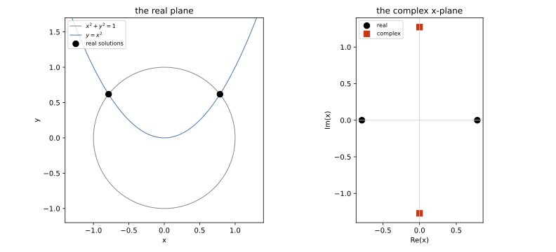
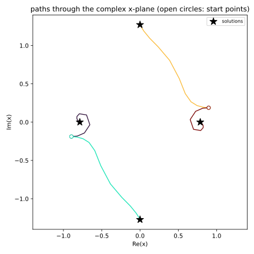

.. _plotting-solutions-and-paths:

📈 Plotting solutions and paths
*******************************

.. testsetup:: *

   import numpy as np
   import bertini

Solutions come back as multiprecision numbers, and multiprecision numbers are not float64.
A screen resolves about three digits, so drawing one has to drop the rest somewhere -- this
page is about where that happens, what you can hand straight to a plotting library, and the
one thing bertini refuses to draw.

Most of it is short: ``real_mp`` data goes onto a matplotlib axis like any other number.
Complex data does not, and the reason is worth reading before you plot your first solve.

Solving something to draw
=========================

The unit circle meets the parabola :math:`y = x^2` in four points: two real, and a
conjugate pair with :math:`x` purely imaginary.

.. testcode::

   import bertini
   from bertini import ZeroDimSolver, SolutionPathCollector

   bertini.recording(False)          # so the solve really tracks, rather than recalling
   bertini.random.set_random_seed(2)

   x, y = bertini.Variable('x'), bertini.Variable('y')
   system = bertini.System()
   system.add_variable_group(bertini.VariableGroup([x, y]))
   system.add_function(x*x + y*y - 1)
   system.add_function(y - x*x)

   solver = ZeroDimSolver(system, mptype='adaptive')
   paths = SolutionPathCollector()
   solver.add_observer(paths)
   solver.solve()

   solutions = solver.all_solutions()
   assert len(solutions) == 4

Real data needs nothing
=======================

``real_mp`` converts to a float, and importing bertini registers a converter with
matplotlib for the calls that compute against plain floats before they draw.  So all of
this works on multiprecision arrays and on plain lists of them, with no conversion of your
own:

.. testcode::

   import matplotlib.pyplot as plt
   from bertini.multiprec import real_mp

   values = np.array([real_mp(k) / real_mp(7) for k in range(1, 20)])

   fig, ax = plt.subplots()
   ax.plot(values, values*values)
   ax.scatter(values, values*values, c=values)
   ax.hist(values)                      # needs the converter
   ax.bar(values, values, width=0.01)   # needs the converter
   ax.axvline(values[0])
   ax.set_xlim(values[0], values[-1])
   plt.close(fig)

The values themselves are untouched; only what goes to the axis becomes float64.

Complex data is refused
=======================

numpy's ``.real`` and ``.imag`` are wired to its own three complex types.  On an array of
any other complex dtype -- ``complex_mp`` included -- ``.real`` hands back **the array
itself** and ``.imag`` hands back **zeros**, with no error and no warning.  There is no
hook for a user dtype to correct that.

So the spelling every numpy user reaches for would draw a picture that is wrong rather than
one that is missing:

.. testcode::

   xs = np.array([solution[0] for solution in solutions])

   try:
       plt.scatter(xs.real, xs.imag)          # would put every point on the x axis
   except TypeError as refused:
       print(str(refused).split('.')[0])

.. testoutput::

   a multiprecision complex value cannot be an axis coordinate

Complex values are turned away at the axis for exactly this reason: the wrong spelling
cannot silently succeed.  Take the parts explicitly instead, with
:func:`bertini.real` and :func:`bertini.imag`, which are correct for every mp container:

.. testcode::

   fig, ax = plt.subplots()
   ax.scatter(bertini.real(xs), bertini.imag(xs))
   ax.set_xlabel('Re(x)'); ax.set_ylabel('Im(x)')
   plt.show()

Solutions from :func:`bertini.solve` are a little friendlier: a
:class:`~bertini.records.Solution` overrides ``.real`` and ``.imag`` itself, so on one of
those the usual spelling is correct and is allowed through.  The refusal is for plain
arrays, which is what you get from ``all_solutions()``, from ``np.array([...])``, and from
any slicing that drops the subclass.

   The real plane, and the complex :math:`x`-plane.  The two real solutions lie on the real
   axis; the conjugate pair is mirrored across it.

Paths are already float64
=========================

Path data does not come back multiprecision.  A collector records each step as it happened,
in ``complex128``, so paths plot like any other numpy array -- ``.real`` and ``.imag``
included, because these really are numpy's own complex numbers:

.. testcode::

   points = paths.series[0].points()
   assert points.dtype == np.dtype('complex128')

   fig, ax = plt.subplots()
   for path in paths.series:
       pts = path.points()
       affine = pts[:, 1] / pts[:, 0]        # dehomogenize the first coordinate
       ax.plot(affine.real, affine.imag, lw=1.3)
   ax.scatter(bertini.real(xs), bertini.imag(xs), c='k', marker='*', s=160)
   plt.show()

   The four homotopy paths through the complex :math:`x`-plane, ending at the four
   solutions.  Open circles are the start points.

What still needs a cast
=======================

A converter is only consulted for data on its way to an **axis**.  Image data, contour
levels and marker sizes never pass that way, so those want an explicit cast --
``.astype(float)``, which is exact up to the nearest double:

.. testcode::

   grid = np.array([[real_mp(i*3 + j) for j in range(3)] for i in range(3)])

   fig, ax = plt.subplots()
   ax.imshow(grid.astype(float))                       # image data
   ax.scatter([0, 1], [0, 1], s=np.array([real_mp(50), real_mp(90)]).astype(float))
   plt.close(fig)

For a complex array, take the part first: ``bertini.real(zs).astype(float)``.

There is deliberately no automatic conversion.  ``real_mp`` and ``float64`` have no common
dtype, so ``mp_array * 0.5`` does not quietly become a double array -- an automatic
promotion would drop every digit past the sixteenth in ordinary arithmetic, silently,
which is the thing this whole page is arranged to prevent.

pandas
======

Multiprecision values live in an ``object`` column, where they stay exact: ``.sum()`` of an
mp column is still multiprecision.  ``DataFrame.plot.scatter`` draws such a column directly,
through matplotlib and its converter.

``DataFrame.plot()`` and ``.plot.hist()`` do not: pandas selects numeric columns by dtype
*before* any drawing happens, and an object column is not numeric, so it reports "no numeric
data to plot".  Cast the frame for those:

.. testcode::

   import pandas as pd

   frame = pd.DataFrame({'x': [real_mp(k) / real_mp(7) for k in range(1, 6)],
                         'y': [real_mp(k) for k in range(1, 6)]})

   ax = frame.plot.scatter(x='x', y='y')          # fine as it is
   plt.close(ax.figure)

   ax = frame.astype(float).plot(x='x', y='y')    # cast for the dtype-screened calls
   plt.close(ax.figure)

To split a complex column into parts, map over it -- a single ``complex_mp`` has correct
``.real`` and ``.imag``; it is only the array-level attributes that lie:

.. testcode::

   points = pd.DataFrame({'x': [solution[0] for solution in solutions]})
   points['re'] = points.x.map(lambda z: float(z.real))
   points['im'] = points.x.map(lambda z: float(z.imag))

plotly, and anything that serializes to JSON
============================================

plotly builds a JSON document rather than drawing to an axis, and it has no converter
registry to fill in.  Handing it multiprecision values raises
``TypeError: Type is not JSON serializable: real_mp`` -- loud, which is the right outcome,
and the same is true of the complex types, so there is no silent trap there either.

Convert on the way in:

.. code-block:: python

   import plotly.graph_objects as go

   go.Figure(go.Scatter(x=bertini.real(xs).astype(float),
                        y=bertini.imag(xs).astype(float),
                        mode='markers'))

The same rule covers any library that writes your data somewhere instead of drawing it:
cast at the boundary, and keep the multiprecision values on your side of it.
