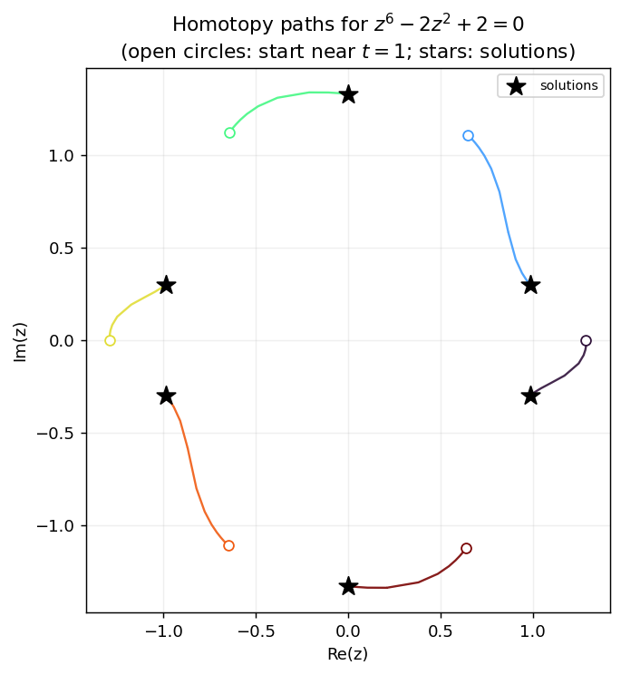

👀 Watching the paths: observers and path data
*************************************************

.. testsetup:: *

   import bertini

Bertini tracks solution paths, but by default you only see where they *end*.  An **observer**
lets you watch what happens *along* the way: it is a small object you attach to a tracker (or to
any observable), whose ``Observe`` method is called with an **event** every time something
happens -- a step succeeds, the precision changes, a path starts or ends.  This tutorial builds
up from a one-line observer to a *meta-observer* that records every path of a whole solve into
numpy arrays, and plots them.

Writing an observer in Python
=============================

Subclass the precision-appropriate ``CustomObserver`` base (``amp`` for adaptive precision,
``double`` or ``multiple`` for fixed) and override ``Observe``.  Events arrive as objects you
discriminate with :func:`isinstance`; every tracking event can hand you the live tracker via
``event.tracker()``, from which you can read the current state of the path::

    import bertini
    import bertini.tracking as tracking

    class StepPrinter(tracking.observers.amp.CustomObserver):
        def Observe(self, event):
            if isinstance(event, tracking.observers.amp.SuccessfulStep):
                trk = event.tracker()
                print("t =", complex(trk.current_time()),
                      " |z| =", trk.current_point(),
                      " cond =", float(trk.latest_condition_number()))

The tracker exposes the whole per-step state: ``current_time()``, ``current_point()``,
``current_precision()``, ``current_stepsize()``, ``delta_t()``, ``latest_condition_number()``,
``latest_norm_of_step()`` and ``latest_error_estimate()``.

Attach it to a tracker, run, and detach::

    tracker.add_observer(StepPrinter())
    tracker.track_path(...)

For the common "call this function when that event happens" case there is a ready-made
``CallbackObserver`` so you do not even write a class::

    obs = tracking.observers.amp.CallbackObserver()
    obs.on(tracking.observers.amp.PrecisionChanged,
           lambda e: print(e.previous(), "->", e.next()))
    tracker.add_observer(obs)

.. note::

   The ``event`` object is only valid for the duration of the ``Observe`` call -- it is a
   short-lived temporary, and so is anything ``event.tracker()`` hands back.  **Read what you
   need and copy it out** (into a list, a numpy array, ...); never stash the event for later.
   An observer can also unsubscribe itself by ``return``-ing
   ``bertini.tracking.ObserveResult.Unsubscribe`` (returning nothing means "keep observing").

Collecting one path into numpy
==============================

To *plot* a path we need its data as arrays.  ``PathDataCollector`` is an observer that, on every
successful step, records the time, the space point, and a few diagnostics.  Adaptive precision
hands back arbitrary-precision (mpfr) numbers, which do not all fit in one numpy array, so each
value is cast to a plain python ``complex``/``float`` as it is collected (double precision is
plenty for a picture).  The result is offered as several typed arrays::

    b = tracking.observers.amp.PathDataCollector()
    tracker.add_observer(b)
    tracker.track_path(...)
    tracker.remove_observer(b)

    t   = b.times()          # complex,  shape (n_steps,)
    z   = b.points()         # complex,  shape (n_steps, n_vars)
    dgn = b.diagnostics()    # float,    shape (n_steps, 4): |t|, condition number, precision, stepsize

If you have pandas installed, ``b.as_dataframe()`` returns the whole path as a labelled
DataFrame (a ``t`` column, one ``z0``, ``z1``, ... per variable, then the diagnostic columns).

The meta-observer: every path of a whole solve
==============================================

A zero-dimensional solve tracks *many* paths, reusing **one** tracker for all of them.  We want
one ``PathDataCollector`` per solution path -- but a collector watches a tracker, while "which
path are we on" is known only to the *solver*.  The elegant fix is an observer that, in response
to the solver's events, attaches and detaches *other* observers: a meta-observer.

That is exactly :class:`bertini.nag_algorithm.SolutionPathCollector`.  You attach it to the
**solver**.  The solver emits ``PathBeginning``/``PathComplete`` around each path; on
``PathBeginning`` the meta-observer spins up a fresh ``PathDataCollector`` and attaches it to the
solver's tracker, and on ``PathComplete`` it harvests that collector into ``.series`` and detaches
it.  Each path gets its own collector with its own empty buffer -- per-path isolation for free.

Because the solver reuses its one tracker for a path's main homotopy track **and** that path's
endgame sub-tracks, the collector that is attached for the whole ``PathBeginning``-to-
``PathComplete`` window captures the *entire* journey to :math:`t \to 0`, endgame included --
without any filtering.  (The attach and detach happen *from inside* ``Observe``; the observable
defers those changes until the current notification finishes, which is what makes it safe.)

We will solve a degree-six univariate polynomial -- a total-degree homotopy with six paths::

    import numpy as np
    import matplotlib.pyplot as plt
    import bertini
    from bertini.nag_algorithm import ZeroDim, SolutionPathCollector

    z = bertini.Variable('z')
    sys = bertini.System()
    sys.add_variable_group(bertini.VariableGroup([z]))
    sys.add_function(z**6 - 2*z**2 + 2)

    solver = ZeroDim(sys, mptype='adaptive')

    A = SolutionPathCollector()
    solver.add_observer(A)
    solver.solve()

    assert len(A.series) == 6          # one PathDataCollector per solution path

Plotting the paths
==================

Each tracked point lives in the homogenized coordinates the start system works in (column 0 is
the homogenizing coordinate), so we divide it out to get the affine :math:`z`, then draw each
path in the complex plane::

    fig, ax = plt.subplots(figsize=(6, 6))
    cmap = plt.get_cmap('turbo')
    for i, path in enumerate(A.series):
        pts  = path.points()
        zaff = pts[:, 1] / pts[:, 0]                 # dehomogenize to affine z
        color = cmap(i / max(len(A.series) - 1, 1))
        ax.plot(zaff.real, zaff.imag, '-', color=color, lw=1.3)
        ax.plot(zaff.real[0], zaff.imag[0], 'o', color=color, ms=6, mfc='white')  # start, t near 1

    sols = [complex(s[0]) for s in solver.solutions()]
    ax.scatter([s.real for s in sols], [s.imag for s in sols],
               c='k', marker='*', s=140, zorder=5, label='solutions')
    ax.set_aspect(1.0)             # 1:1 data aspect ratio
    ax.set_xlabel('Re(z)'); ax.set_ylabel('Im(z)')
    ax.legend(loc='upper right', fontsize=8)
    plt.show()

   The six homotopy paths of :math:`z^6 - 2z^2 + 2 = 0`.  Open circles are where each path is
   first sampled (near the start time :math:`t=1`); stars are the computed solutions
   (:math:`t \to 0`).  Each path runs all the way to its solution -- the endgame sub-tracks,
   captured alongside the main track, carry it the last of the way in.

If instead you want the bare tracker-level building block (one series per *track*, with endgame
sub-tracks kept separate), attach a ``bertini.tracking.observers.<precision>.PathCollectionObserver``
to ``solver.get_tracker()`` directly; each of its series is tagged with a ``start_time`` so you can
tell main tracks from endgame loops.

From here you can collect anything the tracker exposes: plot the condition number along each path
to see where tracking got hard, colour by precision to watch adaptive precision kick in, or feed
``as_dataframe()`` straight into your favourite analysis tools.
