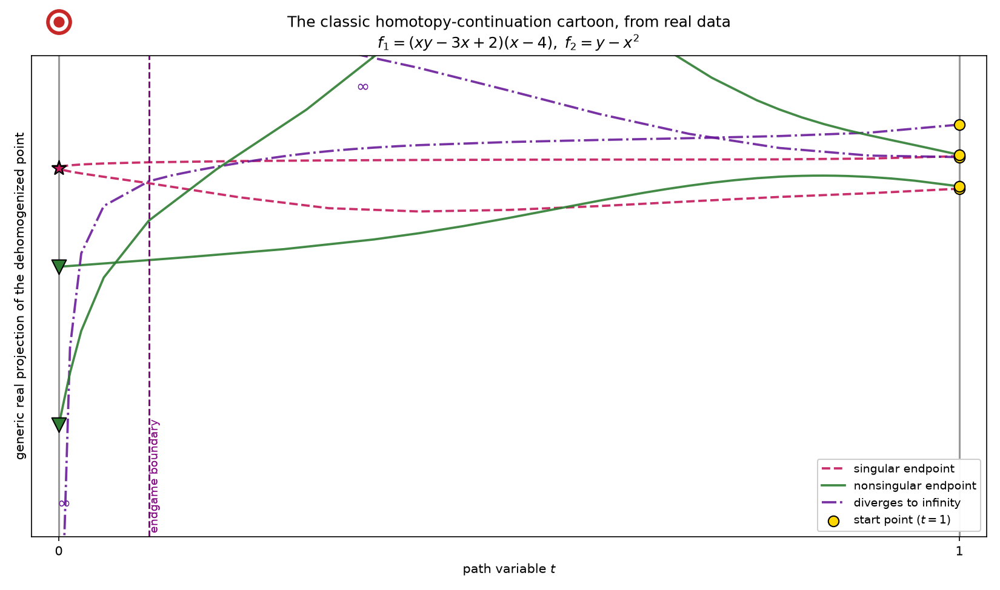

🖼️ The classic continuation cartoon, from real data
*****************************************************

Every introduction to homotopy continuation draws the same picture: smooth start points at
:math:`t=1` on the right, paths flowing left to the target's solutions at :math:`t=0`, past an
*endgame boundary*; the endpoints come in three flavors — **nonsingular**, **singular**, and "at
**infinity**" (paths that diverge).  Here is the hand-drawn version:

.. image:: /../../../doc_resources/images/homotopycontinuation_generic.png
   :width: 90%
   :alt: the classic (hand-drawn) homotopy-continuation cartoon

This tutorial reproduces that drawing from a **real solve** — every curve is genuine tracked data —
with each path styled by the kind of endpoint it reaches.  It builds on the observer machinery from
:doc:`/tutorials/observing_metadata_more/observers_and_path_data/index`.

A small system with one of each flavor
======================================

We want only a handful of paths, with a singular endpoint, a few nonsingular ones, and some that
diverge.  This system delivers exactly that:

.. math::

   f_1 = (x y - 3x + 2)(x - 4), \qquad f_2 = y - x^2 .

Substituting :math:`y = x^2` gives :math:`(x-1)^2 (x+2)(x-4) = 0`: a **double** root at
:math:`x=1` — a *singular* endpoint reached by two paths — and simple roots at :math:`x=-2, 4`
(*nonsingular*).  The total-degree start system has 6 paths, so the remaining two **diverge to
infinity** (the homogenizing coordinate goes to zero).

Collecting the paths, classified by endpoint
============================================

Attach a ``SolutionPathCollector`` to the solver; it captures each path (the whole journey to
:math:`t \to 0`).  After solving, the per-path ``solution_metadata()`` tells us each endpoint's
flavor, so we can style each curve:

.. literalinclude:: classic_continuation_cartoon.py
   :language: python
   :start-at: def classify(meta):
   :end-at: return out

.. note::

   The collector records the **start point** too, not just the accepted steps.  Its
   ``PathDataCollector`` watches ``TrackingStarted`` (which fires at :math:`t=1`, before any step)
   in addition to ``SuccessfulStep`` — so every path begins at its start-system root on the right,
   exactly as the cartoon shows.  A step-only collector would start one step in, near
   :math:`t \approx 0.9`.

Drawing it
==========

A few choices turn the data into the cartoon:

* **height** is a fixed *generic complex projection* of the dehomogenized coordinates down to one
  real number.  A single coordinate's real part would make the structured total-degree start points
  (scaled roots of unity) land on top of each other; a generic projection separates them.
* the vertical axis is given a **finite window sized to the finite roots**, so the two paths that
  diverge to infinity do not compress everything else into a flat line.  Each diverging path is drawn
  only up to where it leaves the window, then cut off with an :math:`\infty` just inside the axis (no
  endpoint marker) — the cartoon's "burst".
* each flavor gets a distinct **line style and color and endpoint marker** (so it survives grayscale
  / color-blind viewing): nonsingular solid ``▽``, singular dashed ``★``, infinite dash-dot.
* a bullseye marks the **target** :math:`f(z)=0` at :math:`t=0`, the start points (gold) sit on the
  right at :math:`t=1`, and the **endgame boundary** is drawn at :math:`t=0.1`.

Run it (needs ``matplotlib``)::

    python python/docs/source/tutorials/classic_continuation_cartoon/classic_continuation_cartoon.py .

The same shape as the hand drawing — start points on the right, three flavors of endpoint on the
left, two paths funnelling into the single singular point, two diverging to infinity — but now every
wiggle is a real tracked path of an actual homotopy.

.. note::

   The total-degree start points being *scaled roots of unity* (a structured set, not generic) is
   exactly why a naive single-coordinate height collapses them.  That structure is a known wart in
   the current ``TotalDegreeLinearProduct`` start system; a genuinely randomized (linear-product) total-degree
   start would put them in general position.
