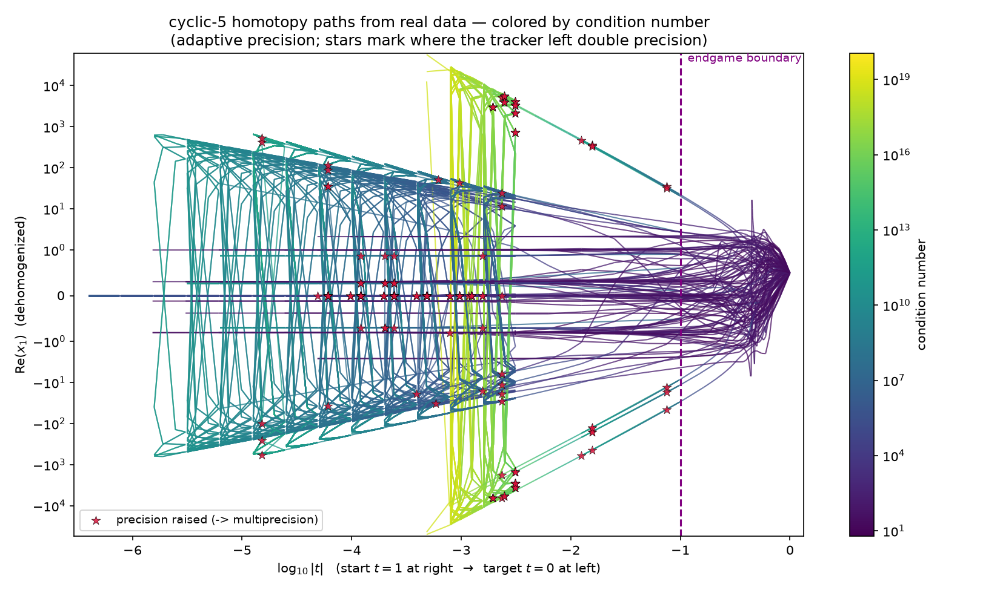

🎨 The continuation cartoon, from real data — and seeing precision change
**************************************************************************

Every introduction to homotopy continuation draws the same cartoon: smooth start points on the
right at :math:`t=1`, paths flowing left to the solutions of the target at :math:`t=0`, past an
*endgame boundary*, with a few paths shooting off to infinity.  It is a *drawing*.

This tutorial makes that picture from a **real solve** — and uses the same machinery to *see* the
one thing the cartoon never shows: where an adaptive-precision tracker decides double precision is
no longer enough and raises its working precision.  It builds directly on
:doc:`/tutorials/observing_metadata_more/observers_and_path_data/index` (read that first for how observers and ``PathDataCollector`` work).

The idea
========

We solve cyclic-5 with the adaptive-precision Cauchy solver and attach a
``SolutionPathCollector``.  That meta-observer attaches a fresh ``PathDataCollector`` to whichever
tracker actually runs each path, and harvests the **whole journey to** :math:`t \to 0` (endgame
included) into one pandas DataFrame per path.  Each row is one accepted step, with the time, the
space point, and the per-step diagnostics ``condition_number`` and ``precision``.

.. literalinclude:: amp_precision_cartoon.py
   :language: python
   :start-after: from bertini.tracking import observers
   :end-at: return [s.as_dataframe() for s in collector.series if len(s) > 0]

Each path's DataFrame carries everything the picture needs::

    >>> paths = collect_paths()
    >>> paths[0].columns.tolist()
    ['t', 'z0', 'z1', 'z2', 'z3', 'z4', 'z5', 'abs_t', 'condition_number', 'precision', 'stepsize']

Drawing it
==========

We plot, for every path:

* **x** = :math:`\log_{10}|t|`, so the start (:math:`t=1`) is on the right and the target
  (:math:`t \to 0`) is on the left — *logarithmic time*, because all the interesting structure is
  near :math:`t=0`;
* **height** = the real part of a dehomogenized coordinate.  Paths weave and fan out to the
  distinct endpoints; a path going to infinity has its homogenizing coordinate go to zero, so the
  dehomogenized height shoots off — that is the cartoon's "infinite endpoints", straight from data
  (the height axis is ``symlog`` so those are visible alongside the finite ones);
* **color** = the condition number along the path (log scale);
* a vertical line at the **endgame boundary** (:math:`t = 0.1`);
* a **star wherever the tracker raised its working precision**.

The full plotting routine is in the example script; the heart of it is coloring each path by its
condition number with a ``LineCollection`` and scattering a marker at each precision increase:

.. literalinclude:: amp_precision_cartoon.py
   :language: python
   :start-at: pts = np.array([x, y]).T.reshape(-1, 1, 2)
   :end-at: esc_x.extend(x[inc]); esc_y.extend(y[inc])

Run the whole thing (needs ``matplotlib`` and ``pandas``)::

    python python/docs/source/tutorials/homotopy_cartoon_from_real_data/amp_precision_cartoon.py .

Reading the picture
===================

* On the **right** (near :math:`t=1`) the paths emerge from a tight cluster of start points and are
  uniformly dark — **low condition number, double precision, no stars**.  Pre-endgame tracking is
  easy.
* Color rises (toward yellow) as paths approach :math:`t=0`, and the **precision-raise stars appear
  almost entirely to the left of the endgame boundary** — precision tracks *conditioning*, and the
  hard conditioning lives in the endgame.
* The paths that **diverge to infinity** (homogenizing coordinate :math:`\to 0`) are the
  highest-condition ones (bright) and shoot to the top/bottom of the height axis; they legitimately
  need multiprecision before the solver truncates them.
* The **finite, well-conditioned** paths — the ones whose endpoints are the actual cyclic-5
  solutions — stay dark and starless essentially all the way in.

That last point is the payoff of a specific fix.  Before it (ADR-0038), the cost model fed a
predictor *error-proportionality constant* (``size_proportion``, which blows up to ~\ :math:`10^{51}`
in the endgame roundoff regime) into AMP Criterion B as if it were the latest Newton residual, and
**forced 39 of the 70 finite paths into multiprecision** even though all 70 converge in pure double.
With Criterion B reading the actual Newton residual instead, almost every finite path now stays in
double — visible here as the near-absence of stars on the well-conditioned paths.  The same observer
machinery that drew this picture is exactly how that diagnosis was made: attach, collect, look.

.. note::

   This is *real data*, so it is messier than the textbook drawing — the endgame's Cauchy sample
   circles make :math:`|t|` wander rather than march monotonically to zero, which shows up as the
   vertical excursions on the left.  That messiness is the point: it is what continuation actually
   does.  For a deliberately clean, cartoon-faithful recreation (one singular endpoint, several
   nonsingular, a couple diverging, styled by endpoint type) see the model drawing in
   ``doc_resources/images/homotopycontinuation_generic.png``.
