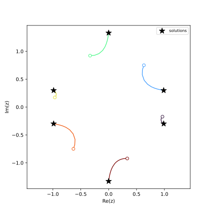
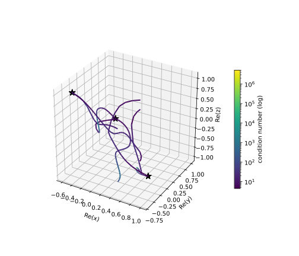
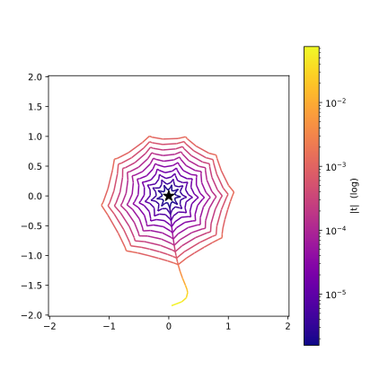

👀 Watching the paths: observers and path data
*************************************************

.. testsetup:: *

   import bertini

.. testcleanup:: *

   bertini.recording(True)   # this document runs bare (see the note); restore for the rest

Bertini tracks solution paths, but by default you only see where they *end*.  An **observer**
lets you watch what happens *along* the way: it is a small object you attach to a tracker (or to
any observable), whose ``Observe`` method is called with an **event** every time something
happens -- a step succeeds, the precision changes, a path starts or ends.  This tutorial builds
up from a one-line observer to a *meta-observer* that records every path of a whole solve into
numpy arrays, and plots them.

Writing an observer in Python
=============================

Subclass the precision-appropriate ``CustomObserver`` base (``amp`` for adaptive precision,
``double`` or ``multiple`` for fixed) and override ``Observe``.  Events arrive as objects you
discriminate with :func:`isinstance`; every tracking event can hand you the live tracker via
``event.tracker()``, from which you can read the current state of the path:

.. testcode::

    import bertini
    import bertini.tracking as tracking

    class StepPrinter(tracking.observers.amp.CustomObserver):
        def Observe(self, event):
            if isinstance(event, tracking.observers.amp.SuccessfulStep):
                trk = event.tracker()
                print("t =", complex(trk.current_time()),
                      " |z| =", trk.current_point(),
                      " cond =", float(trk.latest_condition_number()))

The tracker exposes the whole per-step state: ``current_time()``, ``current_point()``,
``current_precision()``, ``current_stepsize()``, ``delta_t()``, ``latest_condition_number()``,
``latest_norm_of_step()`` and ``latest_error_estimate()``.

Attach it to a tracker, run, and detach.  Here is a small adaptive-precision tracker on the
one-variable homotopy :math:`y - t` (whose single path runs from :math:`y=1` at :math:`t=1` to
:math:`y=0` at :math:`t=0`) to watch:

.. testcode::

    import numpy as np
    from bertini.multiprec import complex_mp

    y, t = bertini.Variable('y'), bertini.Variable('t')
    sys = bertini.System()
    sys.add_function(y - t)
    sys.add_path_variable(t)
    sys.add_variable_group(bertini.VariableGroup([y]))

    tracker = bertini.AMPTracker(sys)
    tracker.setup(bertini.Predictor.Euler, 1e-5, 1e5,
                  tracking.SteppingConfig(), tracking.NewtonConfig())
    tracker.precision_setup(tracking.amp_config_from(sys))

    printer = StepPrinter()
    tracker.add_observer(printer)
    end = np.zeros(sys.num_variables(), dtype=complex_mp)
    tracker.track_path(end, complex_mp(1), complex_mp(0), np.array([complex_mp(1)]))
    tracker.remove_observer(printer)

.. testoutput::
   :options: +ELLIPSIS

   t = ...
   ...

For the common "call this function when that event happens" case there is a ready-made
``CallbackObserver`` so you do not even write a class:

.. testcode::

    obs = tracking.observers.amp.CallbackObserver()
    obs.on(tracking.observers.amp.PrecisionChanged,
           lambda e: print(e.previous(), "->", e.next()))
    tracker.add_observer(obs)
    tracker.remove_observer(obs)

.. note::

   The ``event`` object is only valid for the duration of the ``Observe`` call -- it is a
   short-lived temporary, and so is anything ``event.tracker()`` hands back.  **Read what you
   need and copy it out** (into a list, a numpy array, ...); never stash the event for later.
   An observer can also unsubscribe itself by ``return``-ing
   ``bertini.tracking.ObserveResult.Unsubscribe`` (returning nothing means "keep observing").

Collecting one path into numpy
==============================

To *plot* a path we need its data as arrays.  ``PathDataCollector`` is an observer that, on every
successful step, records the time, the space point, and a few diagnostics.  Adaptive precision
hands back arbitrary-precision (mpfr) numbers, which do not all fit in one numpy array, so each
value is cast to a plain python ``complex``/``float`` as it is collected (double precision is
plenty for a picture).  The result is offered as several typed arrays:

.. testcode::

    b = tracking.observers.amp.PathDataCollector()
    tracker.add_observer(b)
    end = np.zeros(sys.num_variables(), dtype=complex_mp)
    tracker.track_path(end, complex_mp(1), complex_mp(0), np.array([complex_mp(1)]))
    tracker.remove_observer(b)

    ts  = b.times()          # complex,  shape (n_steps,)
    zs  = b.points()         # complex,  shape (n_steps, n_vars)
    dgn = b.diagnostics()    # float,    shape (n_steps, 4): |t|, condition number, precision, stepsize

    assert len(ts) > 0 and zs.shape[1] == sys.num_variables()

If you have pandas installed, ``b.as_dataframe()`` returns the whole path as a labelled
DataFrame (a ``t`` column, one ``z0``, ``z1``, ... per variable, then the diagnostic columns).

The meta-observer: every path of a whole solve
==============================================

A zero-dimensional solve tracks *many* paths, reusing **one** tracker for all of them.  We want
one ``PathDataCollector`` per solution path -- but a collector watches a tracker, while "which
path are we on" is known only to the *solver*.  The elegant fix is an observer that, in response
to the solver's events, attaches and detaches *other* observers: a meta-observer.

That is exactly :class:`bertini.SolutionPathCollector`.  You attach it to the
**solver**.  The solver emits ``PathStarted``/``PathComplete`` around each path; on
``PathStarted`` the meta-observer spins up a fresh ``PathDataCollector`` and attaches it to the
solver's tracker, and on ``PathComplete`` it harvests that collector into ``.series`` and detaches
it.  Each path gets its own collector with its own empty buffer -- per-path isolation for free.

Because the solver reuses its one tracker for a path's main homotopy track **and** that path's
endgame sub-tracks, the collector that is attached for the whole ``PathStarted``-to-
``PathComplete`` window captures the *entire* journey to :math:`t \to 0`, endgame included --
without any filtering.  (The attach and detach happen *from inside* ``Observe``; the observable
defers those changes until the current notification finishes, which is what makes it safe.)

We will solve a degree-six univariate polynomial -- a total-degree homotopy with six paths:

.. testcode::

    import numpy as np
    import matplotlib.pyplot as plt
    import bertini
    from bertini import ZeroDimSolver, SolutionPathCollector

    bertini.random.set_random_seed(2)   # so you get exactly this picture
    bertini.recording(False)            # we are here to WATCH tracking -- see the note below

    z = bertini.Variable('z')
    sys = bertini.System()
    sys.add_variable_group(bertini.VariableGroup([z]))
    sys.add_function(z**6 - 2*z**2 + 2)

    solver = ZeroDimSolver(sys, mptype='adaptive')

    A = SolutionPathCollector()
    solver.add_observer(A)
    solver.solve()

    assert len(A.series) == 6          # one PathDataCollector per solution path

.. note::

   Why turn recording off?  If ambient recording is on (see :doc:`../../record_keeping/automatic_record_keeping/index`),
   a solve whose exact ask was already answered **recalls** its results from the records
   instead of tracking -- that is the resuming feature doing its job.  But a recalled
   solve tracks no paths, so observers have nothing to observe.  This tutorial re-solves
   the same system with the same seed on purpose (to compare collectors on identical
   paths), so we run bare.  ``bertini.recording(True)`` puts things back.

Plotting the paths
==================

Each tracked point lives in the homogenized coordinates the start system works in (column 0 is
the homogenizing coordinate), so we divide it out to get the affine :math:`z`, then draw each
path in the complex plane:

.. testcode::

    fig, ax = plt.subplots(figsize=(6, 6))
    cmap = plt.get_cmap('turbo')
    for i, path in enumerate(A.series):
        pts  = path.points()
        zaff = pts[:, 1] / pts[:, 0]                 # dehomogenize to affine z
        color = cmap(i / max(len(A.series) - 1, 1))
        ax.plot(zaff.real, zaff.imag, '-', color=color, lw=1.3)
        ax.plot(zaff.real[0], zaff.imag[0], 'o', color=color, ms=6, mfc='white')  # start, t near 1

    sols = [complex(s[0]) for s in solver.all_solutions()]
    ax.scatter([s.real for s in sols], [s.imag for s in sols],
               c='k', marker='*', s=140, zorder=5, label='solutions')
    ax.set_aspect(1.0); ax.set_box_aspect(1)     # 1:1 data scaling, square box
    ax.set_xlabel('Re(z)'); ax.set_ylabel('Im(z)')
    ax.legend(loc='upper right', fontsize=8)
    plt.show()

   The six homotopy paths of :math:`z^6 - 2z^2 + 2 = 0`.  Open circles are where each path is
   first sampled (near the start time :math:`t=1`); stars are the computed solutions
   (:math:`t \to 0`).  Each path runs all the way to its solution -- the endgame sub-tracks,
   captured alongside the main track, carry it the last of the way in.

If instead you want the bare tracker-level building block (one series per *track*, with endgame
sub-tracks kept separate), attach a ``bertini.tracking.observers.<precision>.PathCollectionObserver``
to ``solver.get_tracker()`` directly; each of its series is tagged with a ``start_time`` so you can
tell main tracks from endgame loops.  (Attaching to ``solver.get_tracker()`` like this only collects
in a **serial** solve -- set ``num_threads = 1`` first; see *Observers, threads, and MPI* below for
why, and use ``SolutionPathCollector`` if you want it to work threaded.)

Build it yourself: one observer that attaches another
=====================================================

``SolutionPathCollector`` is handy to have ready-made, but the pattern behind it -- a parent
observer **A** that, in response to events, attaches a worker observer **B** and has **B report
its findings back to A** -- is worth being able to build yourself.  It is the whole point of the
refactor: observers composing observers at run time.  Let's reconstruct it from scratch.

The division of labour matches the two observables in play.  **B watches the tracker**: it knows
nothing about "paths", it just records every successful step.  **A watches the solver**: it knows
when a path starts and ends, but not the per-step detail.  So A spawns one B per path, and when
the path finishes, B hands its haul back to A.

**B** -- a tracker observer that records each step and, on request, reports back to its parent:

.. testcode::

    import numpy as np
    import bertini
    import bertini.tracking as tracking
    from bertini import ZeroDimSolver
    from bertini.nag_algorithm import observers as nag_observers

    class PathRecorder(tracking.observers.amp.CustomObserver):
        def __init__(self, parent, path_index):
            super().__init__()
            self.parent     = parent          # the observer we report back to
            self.path_index = path_index
            self._times     = []
            self._points    = []

        def Observe(self, event):
            if isinstance(event, tracking.observers.amp.SuccessfulStep):
                trk = event.tracker()
                # copy out *now* -- the event and tracker state are valid only during this call
                self._times.append(complex(trk.current_time()))
                self._points.append([complex(z) for z in trk.current_point()])

        def report(self):
            self.parent.receive(self.path_index,
                                np.array(self._times, dtype=complex),
                                np.array(self._points, dtype=complex))

**A** -- a solver observer that attaches a fresh ``PathRecorder`` per path and collects its report:

.. testcode::

    class MyPathCollector(nag_observers.CustomObserver):
        def __init__(self):
            super().__init__()
            self.paths   = {}     # path_index -> (times, points), filled in by B.report()
            self._active = {}     # path_index -> (tracker, live recorder)

        def Observe(self, event):
            if isinstance(event, nag_observers.PathStarted):
                tracker = event.tracker()      # the tracker that RUNS this path (a thread-local
                b = PathRecorder(self, event.path_index())   # clone when threaded -- not the member
                tracker.add_observer(b)                  # attach B ...   tracker)
                self._active[event.path_index()] = (tracker, b)
            elif isinstance(event, nag_observers.PathComplete):
                tracker, b = self._active.pop(event.path_index())
                tracker.remove_observer(b)               # ... and detach it when the path is done
                b.report()                               # B hands its data back to A

        def receive(self, path_index, times, points):    # B calls this
            self.paths[path_index] = (times, points)

Attach **A** to the solver and run -- one entry in ``A.paths`` per solution path:

.. testcode::

    bertini.random.set_random_seed(2)
    z = bertini.Variable('z')
    sys = bertini.System()
    sys.add_variable_group(bertini.VariableGroup([z]))
    sys.add_function(z**6 - 2*z**2 + 2)

    solver = ZeroDimSolver(sys, mptype='adaptive')
    A = MyPathCollector()
    solver.add_observer(A)
    solver.solve()

    assert len(A.paths) == 6                  # same six paths SolutionPathCollector would give you
    assert all(len(times) > 0 for times, _ in A.paths.values())   # each path actually captured steps

The subtle part is that A's ``add_observer``/``remove_observer`` calls happen *from inside* B's
sibling notification -- A is mutating the tracker's observer list while the solver is mid-dispatch.
That is exactly the case the observer subsystem is built to handle: an observable defers any
attach/detach requested during a notification until the current one finishes, so neither call
disturbs the dispatch in flight.  Attach-and-forget, compose freely.

This hand-built ``MyPathCollector`` is essentially ``SolutionPathCollector`` -- the real one just
reuses the ready-made ``PathDataCollector`` for B (so you get diagnostics and ``as_dataframe()``
too) and harvests the collector object itself instead of a plain tuple.

Observers, threads, and MPI
===========================

A zero-dimensional solve is **multi-threaded by default** -- it uses all your cores, tracking many
paths at once.  That has one consequence you must know when writing observers, and it is the whole
reason the examples above call ``event.tracker()``.

Under threading, **each path runs on its own thread-local *clone* of the tracker**, not on the
solver's one member tracker.  (A fresh tracker copy starts with an empty observer list -- which is
exactly what makes it safe to hand to another thread.)  So:

.. note::

   Attaching a per-path observer to ``solver.get_tracker()`` collects **nothing** during a threaded
   solve: the member tracker runs no paths.  Always attach to **event.tracker()** -- the tracker
   that actually runs *this* path -- as the meta-observers above do.  ``event.tracker()`` is the
   member tracker in a serial solve and the running clone in a threaded one, so the same code is
   correct either way.

Everything else the framework handles for you.  Your Python ``Observe`` is called safely from the
worker threads: notifications are serialized and the GIL is re-acquired around each call, so you
never see two ``Observe`` calls at once and never corrupt your own Python state.  The flip side is
that a *heavy* ``Observe`` serializes the threads against each other -- keep it to copying values
out (as ``PathRecorder`` does); do the plotting and analysis afterwards.

Two more things to expect under threads:

* **Paths complete out of order.**  ``PathComplete`` arrives in finish order, not ``path_index``
  order.  Key your bookkeeping by ``event.path_index()`` (the collectors above do) and sort at the
  end if you need a stable order.
* **Force serial when you must.**  To pin a solve to one thread -- e.g. to attach directly to the
  member tracker, or for a fully reproducible event order -- set ``num_threads = 1``:

.. testcode::

    from bertini import ZeroDimSolver, SolutionPathCollector
    import bertini

    z = bertini.Variable('z')
    sys = bertini.System()
    sys.add_variable_group(bertini.VariableGroup([z]))
    sys.add_function(z**6 - 2*z**2 + 2)

    solver = ZeroDimSolver(sys, mptype='adaptive')
    cfg = solver.get_config(bertini.nag_algorithm.ZeroDimConfig)
    cfg.num_threads = 1                 # 0 = auto (all cores), 1 = serial, N = N threads
    solver.set_config(cfg)

    A = SolutionPathCollector()         # works the same in serial and threaded
    solver.add_observer(A)
    solver.solve()
    assert len(A.series) == 6

Under **MPI** the picture is different again, and observers do **not** span ranks.  In a distributed
solve the manager rank coordinates while the *worker* ranks track the paths, so the per-path events
(``PathStarted``/``PathComplete`` and every tracker step) fire **inside the worker processes** --
not on the manager where you launched the solve.  An observer is a per-process object: it only sees
the events emitted in *its* process.  To collect path data across an MPI run you attach observers on
the workers and gather their results yourself with MPI (e.g. ``comm.gather``); a single observer on
rank 0 will not see the paths.  For shared-memory threading there is nothing to gather -- the worker
threads share the one process, which is why ``SolutionPathCollector`` "just works" with threads but
needs help under MPI.

A 3-D system, coloured by condition number
==========================================

Nothing about this is special to one variable.  Let's solve the **cyclic-3** system in three
variables and plot the paths in :math:`(\operatorname{Re} x, \operatorname{Re} y,
\operatorname{Re} z)` space -- and this time colour each path by its **condition number**, the
diagnostic ``PathDataCollector`` records at every step.  The condition number climbs as a path
approaches a solution (and especially in the endgame), so the colouring shows where the tracking
got hard:

.. testcode::

    import numpy as np
    import matplotlib.pyplot as plt
    import matplotlib.colors as mcolors
    from mpl_toolkits.mplot3d.art3d import Line3DCollection
    import bertini
    from bertini import ZeroDimSolver, SolutionPathCollector

    bertini.random.set_random_seed(3)

    x, y, z = bertini.Variable('x'), bertini.Variable('y'), bertini.Variable('z')
    sys = bertini.System()
    sys.add_variable_group(bertini.VariableGroup([x, y, z]))
    sys.add_function(x + y + z)
    sys.add_function(x*y + y*z + z*x)
    sys.add_function(x*y*z - 1)

    solver = ZeroDimSolver(sys, mptype='adaptive')
    A = SolutionPathCollector()
    solver.add_observer(A)
    solver.solve()

    COND = A.series[0].DIAGNOSTIC_COLUMNS.index("condition_number")

Each ``path.diagnostics()`` is a float array whose columns are named by
``PathDataCollector.DIAGNOSTIC_COLUMNS`` (``abs_t``, ``condition_number``, ``precision``,
``stepsize``) -- so the condition number is just one column.  We draw each path as a 3-D line
whose colour varies along it (a ``Line3DCollection`` with a shared log-scaled colour norm):

.. testcode::

    tracks, all_cond = [], []
    for path in A.series:
        aff  = path.points()[:, 1:] / path.points()[:, 0:1]   # dehomogenize -> 3 affine coords
        real = aff.real                                        # (n, 3): Re(x), Re(y), Re(z)
        cond = path.diagnostics()[:, COND]
        tracks.append((real, cond)); all_cond.append(cond)

    norm = mcolors.LogNorm(vmin=max(min(c.min() for c in all_cond), 1.0),
                           vmax=max(c.max() for c in all_cond))

    fig = plt.figure(figsize=(7, 6))
    ax = fig.add_subplot(111, projection='3d')
    for real, cond in tracks:
        segs = np.stack([real[:-1], real[1:]], axis=1)         # consecutive points -> segments
        lc = Line3DCollection(segs, cmap='viridis', norm=norm)
        lc.set_array(0.5 * (cond[:-1] + cond[1:]))             # colour each segment by condition number
        lc.set_linewidth(2)
        ax.add_collection3d(lc)
        last = lc

    sols = solver.all_solutions()
    ax.scatter([complex(s[0]).real for s in sols],
               [complex(s[1]).real for s in sols],
               [complex(s[2]).real for s in sols], c='k', marker='*', s=120, depthshade=False)
    ax.set_xlabel('Re(x)'); ax.set_ylabel('Re(y)'); ax.set_zlabel('Re(z)')
    ax.set_box_aspect((1, 1, 1))                               # 1:1:1 data aspect ratio
    fig.colorbar(last, ax=ax, shrink=0.6, pad=0.1, label='condition number (log)')
    plt.show()

   The six cyclic-3 homotopy paths in :math:`(\operatorname{Re} x, \operatorname{Re} y,
   \operatorname{Re} z)`, each coloured by its condition number on a log scale (stars: solutions).
   The warm end of the scale appears as the paths crowd in near the solutions, where the Jacobian
   is worst-conditioned.

Watching the Cauchy endgame at a singular solution
==================================================

When a path ends at a **singular** solution, ordinary tracking stalls and the **Cauchy endgame**
takes over: it tracks the path around circles in :math:`t` near :math:`t=0` and averages, which is
how it pins down a multiple root.  Because our per-path collector keeps recording through the
endgame, we can *watch* those loops.  The classic stress test is the **Griewank-Osborn** system,
whose only solution is a triple point at the origin:

.. testcode::

    from fractions import Fraction
    import numpy as np
    import matplotlib.pyplot as plt
    import matplotlib.colors as mcolors
    from matplotlib.collections import LineCollection
    import bertini
    from bertini import ZeroDimSolver, SolutionPathCollector

    bertini.random.set_random_seed(1)

    x, y = bertini.Variable('x'), bertini.Variable('y')
    sys = bertini.System()
    sys.add_variable_group(bertini.VariableGroup([x, y]))
    sys.add_function(bertini.coefficient(Fraction(29, 16)) * x**3 - 2*x*y)  # exact rational coeff
    sys.add_function(y - x**2)

    solver = ZeroDimSolver(sys, mptype='adaptive')
    A = SolutionPathCollector()
    solver.add_observer(A)
    solver.solve()

    # let the solver classify which paths ended at a singular solution
    singular_idx = {int(m.path_index) for m in solver.solution_metadata() if m.is_singular}
    singular = [p for p in A.series if p.path_index in singular_idx]

The catch the plot has to deal with: each Cauchy loop is **geometrically smaller** than the last
(its radius :math:`\sim |t|^{1/c}`), so on a linear zoom they collapse onto the solution and you
see nothing.  Plot the :math:`x`-coordinate on a **log-radial** scale instead -- map
:math:`x \mapsto (\log_{10}|x| - \log_{10}|x|_{\min})\, e^{i\arg x}` -- and the shrinking loops
open out into an even spiral winding into the centre:

.. testcode::

    path = max(singular, key=len)                 # one representative singular path
    aff  = path.points()[:, 1:] / path.points()[:, 0:1]
    xv   = aff[:, 0]
    t    = np.abs(path.times())
    eg   = t < 0.1                                 # the endgame portion (small |t|)
    xv, t = xv[eg], t[eg]

    r    = np.log10(np.abs(xv)) - np.log10(np.abs(xv).min()) + 0.1   # log-radial coordinate
    disp = r * np.exp(1j * np.angle(xv))

    fig, ax = plt.subplots(figsize=(6, 6))
    pts  = np.column_stack([disp.real, disp.imag])
    segs = np.stack([pts[:-1], pts[1:]], axis=1)
    lc = LineCollection(segs, cmap='plasma', norm=mcolors.LogNorm(t.min(), t.max()))
    lc.set_array(0.5 * (t[:-1] + t[1:]))
    ax.add_collection(lc)
    ax.scatter([0], [0], c='k', marker='*', s=160, zorder=5)  # the singular solution, at the centre
    R = -(np.log10(np.abs(xv).min())) + 0.3
    ax.set_xlim(-R, R); ax.set_ylim(-R, R); ax.set_aspect(1.0)
    fig.colorbar(lc, ax=ax, label='|t|  (log)')
    plt.show()

   The Cauchy endgame at the singular solution of Griewank-Osborn, on a log-radial scale (so the
   geometrically-shrinking loops stay visible).  As :math:`|t|\to 0` (dark) the path winds inward
   toward the triple root at the centre -- the loops the endgame integrates around to resolve the
   singular endpoint.

From here you can collect anything the tracker exposes: plot the condition number along each path
to see where tracking got hard, colour by precision to watch adaptive precision kick in, or feed
``as_dataframe()`` straight into your favourite analysis tools.

Complete example
================

The whole tutorial as one runnable script -- it saves the three figures shown above:

.. literalinclude:: observers_and_path_data.py
   :language: python
   :caption: observers_and_path_data.py
