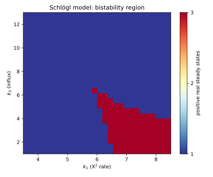

⚗️ A bistable reaction network, mapped in parallel
***************************************************

.. testsetup:: *

   import bertini

A **parameter homotopy** is the right tool whenever you must solve the *same* polynomial system
over and over at *different* coefficient values -- a parameter sweep.  You pay for one hard solve
at a generic parameter, then reach every value you care about by cheap tracking that reuses those
start solutions (the :doc:`parameter_homotopy` tutorial introduces the idea).  This tutorial puts
that to work on a real problem and then makes it *parallel on two levels at once*:

* **MPI across the parameter points** -- the points are independent, so hand each compute node a
  slice of them;
* **threads across the paths** -- inside each point's solve, track the paths on all of that node's
  cores (this is automatic -- a solve is multi-threaded by default).

The driving problem is a **chemical reaction network** and the question is *multistationarity*:
for which rate constants does the network have more than one steady state?

The Schlögl model
=================

The Schlögl network is the textbook example of a bistable reaction network.  Its single species
:math:`X` has a steady state wherever production balances degradation, which works out to a cubic:

.. math::

   k_2\,X^3 \;-\; k_1\,X^2 \;+\; k_4\,X \;-\; k_3 \;=\; 0 .

The rate constants :math:`k_1,\dots,k_4` are the parameters, and they live in the **positive
orthant** (rates are positive).  A *steady state* is a **positive real** root.  By Descartes' rule
of signs this cubic has either **one** or **three** positive real roots -- monostable or bistable
-- and which one depends on where you are in parameter space.  Mapping that boundary is the goal.

The family is one system at many coefficient values, so we build it with a factory over **shared**
variables (a parameter homotopy interpolates coefficients, so every member must use the same
``Variable`` object):

.. testcode::

   import bertini
   from bertini.nag_algorithm import parameter_sweep

   X = bertini.Variable('X')

   def make_system(params):
       k1, k2, k3, k4 = params
       sys = bertini.System()
       sys.add_variable_group(bertini.VariableGroup([X]))
       sys.add_function(k2*X*X*X - k1*X*X + k4*X - k3)
       return sys

Let the solver do the classification
====================================

"How many positive real steady states?" is a question about the solutions' *classification* --
which are real, which are finite -- and the solver already answers it.  ``solver.to_dataframe()``
hands back a pandas DataFrame with an ``is_real`` and ``is_finite`` column per solution (plus
multiplicity and more), so we never re-derive real-ness with a hand-rolled tolerance; we just read
the flags and keep the positive ones:

.. testcode::

   def positive_real_count(solver):
       df = solver.to_dataframe()
       n = 0
       for _, row in df.iterrows():
           if row['is_real'] and row['is_finite']:
               sol = row['solution']
               x = complex(sol[0] if hasattr(sol, '__len__') else sol)
               if x.real > 1e-9:
                   n += 1
       return n

The sweep
=========

:func:`~bertini.nag_algorithm.parameter_sweep` is the whole engine: give it the factory, one
*generic* (random complex) parameter value to solve once, and the list of parameter values you
actually want.  It solves the generic member, then tracks to every target reusing those start
solutions.  Here we sweep a grid of :math:`(k_1, k_3)` with :math:`k_2 = 1, k_4 = 11` fixed, and
reduce each solve straight to its positive-real count with ``collect``:

.. testcode::

   import numpy as np
   C = bertini.multiprec.Complex
   def real_coeff(v):  return C(repr(float(v)), "0")   # an exact real coefficient

   generic = (C("0.7","0.4"), C("1","0.3"), C("0.31","-0.52"), C("1.2","0.9"))

   k1s = np.linspace(4.0, 8.0, 5)
   k3s = np.linspace(2.0, 10.0, 5)
   targets = [(real_coeff(k1), real_coeff(1), real_coeff(k3), real_coeff(11))
              for k3 in k3s for k1 in k1s]

   counts = parameter_sweep(make_system, generic, targets, collect=positive_real_count)

   counts = np.array(counts).reshape(len(k3s), len(k1s))
   assert set(counts.ravel()) <= {1, 3}      # Descartes: only 1 or 3 positive real roots
   assert (counts == 3).any()                # ... and the bistable region is in this window

That ``parameter_sweep`` call was already **threaded** -- a solve uses every core by default, so
the path tracking inside each grid point ran in parallel with no extra code.  For most users, on
one machine, that is the whole story: parallelism for free through the ordinary interface.

Going wide: MPI across the grid
===============================

The grid points are independent, so to use *many machines* you hand each MPI rank a slice of the
grid.  ``parameter_sweep`` does the splitting and gathering for you -- pass a communicator and a
``collect`` (only the reduced value crosses ranks, since solver objects cannot), and **every rank
comes back with the full list of counts**:

.. code-block:: python

   from mpi4py import MPI
   counts = parameter_sweep(make_system, generic, targets,
                            collect=positive_real_count, comm=MPI.COMM_WORLD)
   # one extra argument (comm=) is the entire difference from the serial version

That is the two-level model in one call: MPI spreads the *points* across ranks, and each rank's
solves thread the *paths* across its cores.  The complete, runnable script -- which builds the
grid, runs the sweep, and draws the map -- is
:download:`parallel_parameter_homotopy.py <../../../examples/parallel_parameter_homotopy.py>`:

.. literalinclude:: ../../../examples/parallel_parameter_homotopy.py
   :language: python
   :caption: examples/parallel_parameter_homotopy.py
   :start-after: X = pb.Variable('X')
   :end-before: def main()

Run it serially, or across ranks with threads inside each (the ``--bind-to none`` and
``--map-by`` notes from :doc:`solving_at_scale` apply -- and always run a *file*, never a heredoc)::

   python parallel_parameter_homotopy.py --grid 28 --save schlogl.svg     # serial + threads
   OMP_NUM_THREADS=3 mpirun -n 4 --bind-to none \
       python parallel_parameter_homotopy.py --grid 28 --save schlogl.svg # 4 ranks x 3 threads

Both produce the **identical** map -- parallelism changes the wall-clock, never the answer:

   The Schlögl network's steady states over a slice of its positive-orthant parameter space.  The
   red tongue is the **bistable** region -- three positive real steady states; outside it there is
   one.  Each pixel is one parameter homotopy track; the picture is an MPI-across-pixels,
   threads-within-pixel solve.

Where to go from here
=====================

* Swap in your own network: any steady-state system that is *one shape with varying coefficients*
  drops straight into ``make_system`` + ``parameter_sweep``.  Richer networks have more paths per
  point, so the per-point threading earns more.
* Push ``--grid`` up and spread the ranks across a cluster with a hostfile
  (``mpirun --hostfile hosts ...``); the sweep code does not change.
* See :doc:`solving_at_scale` for the other axis -- distributing the *paths of a single solve*
  across ranks -- and :doc:`observers_and_path_data` to watch the tracking itself.
