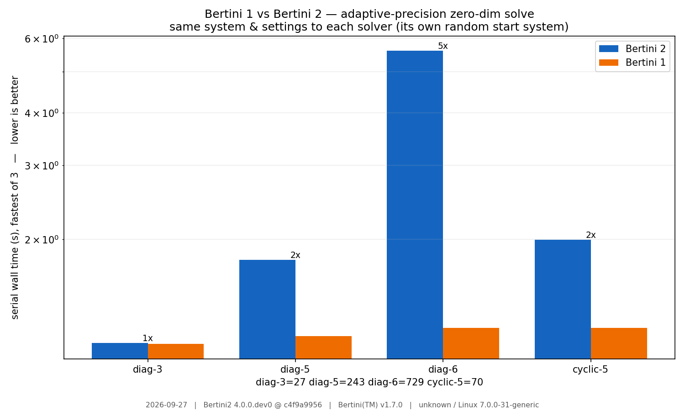

⏱️ Timing Bertini 1 vs Bertini 2
*********************************

Bertini 2 is a from-scratch C++ and Python rewrite of Bertini 1.  We started the rewrite in about 2014.
A fair question is how its speed compares to Bertini 1.7.
This tutorial benchmarks the two on the same systems and ends in a plot — and records *what* was
timed and *where*, so the numbers can be refreshed as the library improves.

The comparison
================

The fair way to compare two solvers is to hand them the **same problem with the same settings**.  We
build each system once in pybertini and emit it as a Bertini-1 classic input with
:py:meth:`System.to_classic_input`, which writes the equations *and* the tracking knobs (precision
mode, predictor, tolerances, step cadence).  Both solvers read that one file, each builds its own
random start system, and solves.  We time only the solver subprocess (never parsing/IO) and keep the
fastest of a few repeats, serial (``BERTINI_NUM_THREADS=1``):

.. literalinclude:: b1_vs_b2_timing.py
   :language: python
   :pyobject: time_solver

(The maintained, fuller harness — which also sweeps MPI ranks and appends a committed ``history.csv``
— is ``benchmark/comparison/run_comparison.py``; this tutorial is a small self-contained cousin.)

Results
==========

Run it (needs ``matplotlib``; Bertini 1 optional)::

    python python/docs/source/tutorials/bertini1_vs_bertini2_timing/b1_vs_b2_timing.py \
        --bertini2 ./build/core/bertini2 --bertini1 /usr/local/bin/bertini

How to read it (for the run shown — see the caption for date/versions/machine):

* Bertini 2 is still **slower** than Bertini 1 on most of these problems — level on the tiny
  diagonal system, up to about 4.4× on ``diag-6``.  This is honest: Bertini 1 is hand-tuned C
  with its own linear algebra; Bertini 2 trades constant-factor speed for a templated,
  observable design.  Silviana knows some low-hanging fruit to be able to go further (eliminating
  more linear algebra in Eigen, because Eigen causes churn for allocated types like ``complex_mp``.)
* The diagonal family ``diag-3/5/6`` is **well-conditioned** (every path stays in double precision),
  so its growing slowdown is pure **per-step tracking overhead** scaling with problem size — a
  standing performance lever, independent of the endgame.
* ``cyclic-5`` exercises the **endgame**.  The adaptive-numeric-type endgame (the Cauchy and
  PowerSeries endgames now compute in hardware ``complex_dbl`` while a path's conditioning allows,
  escalating to mpfr only when the tracker's authority demands it) cut the endgame's **per-operation**
  cost by roughly 10×.  Where a path's endgame stays in double — e.g. the default TotalDegreeBinomial start
  system — cyclic-5 in adaptive precision is now ~Bertini-1 speed (~0.4 s serial, with **0 of 70**
  finite paths needing to escalate above double).

  This benchmark hands both solvers a **total-degree** classic input instead, and on it Bertini 2
  takes about 1.8× Bertini 1's time on cyclic-5 — well below the diagonal family's 4.4× at
  ``diag-6``.

Both solvers report the **same solution counts** (shown under the bars), so this is a like-for-like
comparison, not a speed/accuracy trade.

Some record keeping
=====================

Timing numbers are meaningless without context, and they go stale.  We capture the date, both solver
versions (with the Bertini 2 git commit), and the machine, and stamp them onto the figure:

.. literalinclude:: b1_vs_b2_timing.py
   :language: python
   :pyobject: provenance
