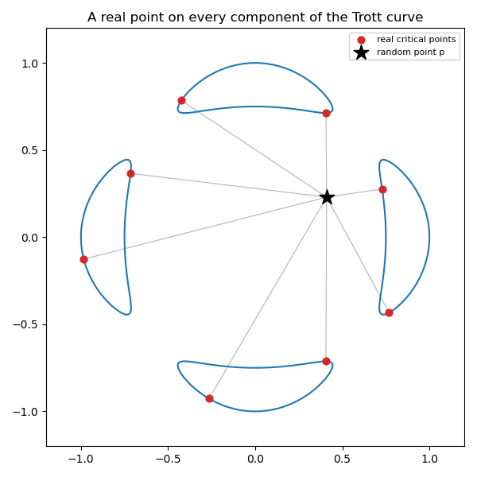

📍 A real point on every component (the Trott curve)
*******************************************************

.. testsetup:: *

   import bertini

Homotopy continuation finds *all* the complex solutions of a system -- but a real curve can have
whole pieces that carry no isolated real solution of :math:`f=0` by itself, and simply solving
:math:`f=0` does not tell you a real point on each one.  Jonathan Hauenstein's method (2013,
*"Numerically computing real points on algebraic sets"*) gives one: pick a random real point
:math:`p`, and compute the **critical points of the squared distance** :math:`\lVert x - p
\rVert^2` restricted to the variety.  Every bounded connected component contains a nearest (and a
farthest) point to :math:`p`, so the critical set contains **at least one real point on every
component** -- and those are honest solutions of a square polynomial system we can solve.

The critical-point system
=========================

On a plane curve :math:`f(x,y)=0`, a point is distance-critical exactly when the line to
:math:`p` meets the curve at right angles -- i.e. the gradient :math:`\nabla f` is parallel to
:math:`x-p`.  In two dimensions "parallel" is one determinant equation, so the critical points
are the solutions of the square system

.. math::

   f = 0, \qquad (x - p_x)\, f_y - (y - p_y)\, f_x = 0 .

We will use the **Trott curve**, a smooth quartic famous for having four separate oval
components:

.. math::

   144\,(x^4 + y^4) - 225\,(x^2 + y^2) + 350\, x^2 y^2 + 81 = 0 .

Building and solving it
=======================

We let bertini differentiate :math:`f` for us, and keep every coefficient exact -- the random
point's coordinates are exact rationals, since :mod:`bertini.linalg` (rightly) refuses python
floats that would silently cap precision:

.. testcode::

    import numpy as np
    from fractions import Fraction
    import bertini
    from bertini import linalg, nag_algorithm

    x, y = bertini.Variable('x'), bertini.Variable('y')
    f = 144*(x**4 + y**4) - 225*(x**2 + y**2) + 350*x**2*y**2 + 81

    # bertini differentiates the curve symbolically -- no hand-coded gradients
    fx, fy = f.differentiate(x), f.differentiate(y)

    # a hardcoded "random" real point p, with exact rational coordinates
    PX, PY = Fraction(41, 100), Fraction(23, 100)
    parallel = (x - linalg.coefficient(PX))*fy - (y - linalg.coefficient(PY))*fx

    crit_system = bertini.System()
    crit_system.add_variable_group(bertini.VariableGroup([x, y]))
    crit_system.add_function(f)
    crit_system.add_function(parallel)

Both equations are degree 4, so the total-degree solve tracks :math:`4 \times 4 = 16` paths.  We
solve, then keep the real solutions -- and we let the *solver* decide what "real" means: each
endpoint's metadata carries an ``is_real`` flag, set when the imaginary parts fall under the
configured ``real_threshold``, so there is no hand-picked epsilon in the tutorial:

.. testcode::

    solver = nag_algorithm.ZeroDim(crit_system, mptype='adaptive')
    solver.solve()

    sols, meta = solver.solutions(), solver.solution_metadata()
    crit = [(complex(s[0]).real, complex(s[1]).real)
            for s, m in zip(sols, meta) if m.is_real]

    assert len(crit) == 8                  # two per oval (nearest + farthest), all four ovals hit

Eight real critical points appear -- the nearest and farthest point of each of the four ovals --
so every connected component of the curve is witnessed by a real point.

Plotting the curve, the point, and the distances
================================================

Plot the curve as an implicit contour, mark :math:`p` and the real critical points, and draw a
segment from :math:`p` to each one so the distances are visible:

.. testcode::

    import matplotlib.pyplot as plt

    px, py = float(PX), float(PY)
    gx, gy = np.meshgrid(np.linspace(-1.2, 1.2, 500), np.linspace(-1.2, 1.2, 500))
    F = 144*(gx**4 + gy**4) - 225*(gx**2 + gy**2) + 350*gx**2*gy**2 + 81

    fig, ax = plt.subplots(figsize=(6, 6))
    ax.contour(gx, gy, F, levels=[0], colors='C0')          # the Trott curve
    for (cx, cy) in crit:
        ax.plot([px, cx], [py, cy], color='0.7', lw=0.8)    # distance to each critical point
    ax.scatter([c[0] for c in crit], [c[1] for c in crit], c='C3', s=40, label='real critical points')
    ax.scatter([px], [py], c='k', marker='*', s=200, label='random point p')
    ax.set_aspect('equal'); ax.legend(loc='upper right', fontsize=8)
    ax.set_title('A real point on every component of the Trott curve')
    plt.show()

   The four ovals of the Trott curve, the hardcoded random point :math:`p` (★), the eight real
   distance-critical points (●), and a segment from :math:`p` to each.

The method needs nothing special of the curve: pick a random real :math:`p` (a generic choice
avoids the measure-zero set where a component's nearest point is non-isolated), build the same
two equations for *your* :math:`f`, solve, and keep the real solutions.
