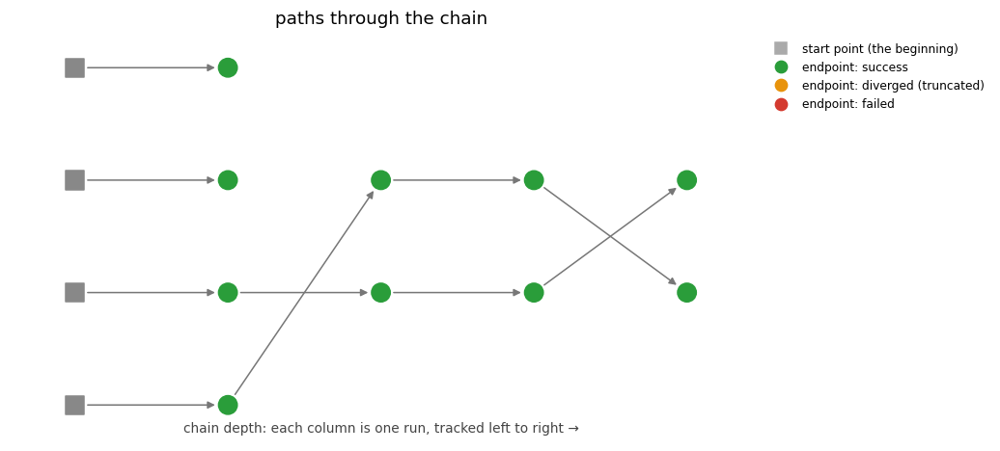

Chained homotopies: provenance all the way back
###############################################

A *chain* is a sequence of solves where each solve's start points are the previous
solve's solutions — the workhorse pattern of parameter continuation.  Because every
solve records where each of its paths started (see :doc:`../automatic_record_keeping/index`), a
chain is more than its final answers: it is a **directed graph of points**, and any
final solution can be walked back through every intermediate run to the very first
start point.

This tutorial builds a small chain from the family :math:`\{x^2 - a^2,\; xy - 1\}`
for growing :math:`a`, and then reads its own records back with the navigation tools.
The family is deliberately not all sunshine: each member has just **two** finite roots
(:math:`(\pm a, \pm 1/a)`) but total degree four, so the first solve tracks four paths
and two of them have nowhere finite to go — they head to infinity.  Each is an
**answer, not a failure**: it either converges to an infinite endpoint or is truncated
near infinity (``diverged``); either way it is recorded, and only the finite solutions
are carried forward, so those lineages simply end.  The complete script is
:download:`chained_homotopies.py <../../../../../examples/chained_homotopies.py>`:

.. literalinclude:: ../../../../../examples/chained_homotopies.py
   :language: python
   :caption: examples/chained_homotopies.py

Chaining is two keyword arguments
=================================

The root of a chain is an ordinary solve.  Every further link passes the homotopy you
built and where its paths start:

.. code-block:: python

   results.append(pb.solve(target, homotopy=blend_homotopy(target, previous),
                           start=results[-1], seed=42))

``start=`` accepts a prior :class:`~bertini.records.SolveResult` (or its solutions) —
those points carry provenance, so the new run's records link back to them with
``point_ref`` references.  Raw arrays work too: they are archived as a **given**, and
provenance bottoms out honestly at data you supplied.  To chain from a run recorded in
*another session* — or by the command-line ``bertini2`` — read its endpoints cold with
:func:`bertini.solutions_of`; they come back as points with provenance, ready to chain.

Reading the chain back
======================

The navigation tools read the plain records — any directory, any producer, no solver
objects:

* :func:`bertini.runs` — one :class:`pandas.DataFrame` row per run: when, how many
  paths, which seed, which software wrote it.
* :func:`bertini.tracks` — one row per tracked path: its verdict (``success`` /
  ``diverged`` / ``failed``), and where it started.  Endpoint coordinates stay out of
  the table unless you pass ``coordinates=True`` — on a million-path audit you want
  the statuses, not the bytes.
* :func:`bertini.provenance_graph` — the points as a :class:`networkx.DiGraph`, one
  edge per path, pointing from where it started to where it ended.  Time flows along
  the edges.
* :func:`bertini.provenance` — the walk for a single point: its chain of
  ``{'run', 'index'}`` hops, ending at a start label or a given.

The picture
===========

:func:`bertini.plot_chain` draws the chain **left to right** — each run a column,
paths flowing rightward from their origins (squares) through every run, colored by
verdict (green success, orange diverged, red failed):

         the first run and two survive to the end
   :align: center

Read it like a family tree.  Four total-degree start points enter the first run; two
of them go to infinity (converging to an infinite endpoint, or truncated as
``diverged`` — either way an answer, and shown coloured by that verdict).  They have
no outgoing edges — an infinite or diverged point is an endpoint of knowledge, not a
start for more tracking — and only the two finite lineages are carried forward, run
after run, to the final member.  ``solve(start=...)`` does that filtering for you: it chains a result's
*finite solutions*.  The same discipline applies to points you would rather not
continue for other reasons (a singular endpoint, say, spotted by its
``cycle_num``/condition number in :func:`bertini.tracks` or ``is_singular`` in the
solver's metadata): what you pass as ``start=`` is what gets carried, and the graph
records exactly what you chose.

Large solves are a design constraint, not an afterthought: a run with more than
``max_paths_drawn`` paths (default 200) is not drawn path-by-path — the figure
automatically aggregates to one node per run, with edge widths showing how many paths
flow between runs, so a million-path chain renders instead of crashing your session.
The same instinct applies to :func:`~bertini.provenance_graph`: pass ``runs=`` to
restrict a big directory to the chains you care about before building a graph out of
it.

Regenerating the figure
=======================

The images above (``.png`` and ``.svg``, both committed) regenerate through the
standard artifact refresher, from the repository root::

   python tools/refresh_doc_artifacts.py --plots --only chained_homotopies
