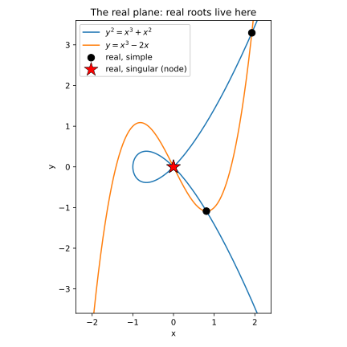
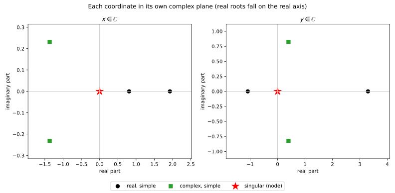

🗃️ A database of solutions: filtering and plotting with pandas
**************************************************************

.. testsetup:: *

   import numpy as np
   import bertini

A solve gives you more than a pile of points.  Every solution carries metadata -- is it finite,
is it real, is it singular, what is its multiplicity and condition number -- and once you have
*all* of that in one table, sorting the solutions into categories and drawing them becomes a
matter of one-line filters.  That table is what :meth:`to_dataframe` returns: the whole solve as a
:mod:`pandas` DataFrame, **one row per solution**.

We will solve the intersection of two plane curves chosen to show every kind of root at once --
real and complex, simple and singular -- and then use the DataFrame to plot them.

Two plane curves
================

The first curve is a **nodal cubic**, :math:`y^2 = x^3 + x^2`.  It crosses itself at the origin:
that self-crossing is a *node*, a singular point of the curve.  The second is another cubic,
:math:`y = x^3 - 2x`, threaded through that node.

.. testcode::

   import bertini
   from bertini.nag_algorithm import ZeroDim

   x, y = bertini.Variable('x'), bertini.Variable('y')
   sys = bertini.System()
   sys.add_function(y*y - x**3 - x**2)     # nodal cubic   y^2 = x^3 + x^2  (node at the origin)
   sys.add_function(y - x**3 + 2*x)        # second cubic  y = x^3 - 2x     (passes through it)
   sys.add_variable_group(bertini.VariableGroup([x, y]))

   solver = ZeroDim(sys, mptype='adaptive')
   solver.solve()

Because the second curve runs through the node -- where the first curve's gradient vanishes -- the
two curves meet there *singularly*: two homotopy paths arrive at the same point, giving it
multiplicity two.  Away from the node they meet transversally, in a mix of real and complex points.

One row per solution
====================

:meth:`to_dataframe` lays the solve out as a table.  By default it keeps only the finite
solutions (``omit_infinite=True``); each row is a solution, with a column per coordinate
(``x0``, ``x1``) followed by every metadata field.

.. testcode::

   import pandas as pd

   df = solver.to_dataframe()
   assert len(df) == 6                         # six finite endpoints (the node counts twice)
   assert {'x0', 'x1', 'is_real', 'is_singular', 'multiplicity'} <= set(df.columns)

Now each category is a filter on the frame -- and the metadata rides along with the points, so you
never have to line up two parallel lists by index:

.. testcode::

   real_simple    = df[df.is_real & ~df.is_singular]      # transverse real crossings
   complex_simple = df[~df.is_real & ~df.is_singular]      # a complex-conjugate pair
   singular       = df[df.is_singular]                     # the node, multiplicity 2

   assert len(real_simple) == 2
   assert len(complex_simple) == 2
   assert len(singular) == 2 and (singular.multiplicity == 2).all()

(The three paths that diverged are not in the frame; ``solver.to_dataframe(omit_infinite=False)``
keeps them, and ``solver.infinite_solutions()`` returns just those at-infinity endpoints.)

The catch: a complex root does not live in the plane
====================================================

Here is the honest difficulty in *drawing* these solutions.  A solution is a pair :math:`(x, y)`
of **complex** numbers -- four real numbers -- but the page has only two axes.  Only the **real**
solutions are genuine points of the real :math:`(x, y)` plane; the complex ones are not there at
all.  So we draw two different kinds of picture.

To plot, lift each coordinate from a :class:`bertini.multiprec.Complex` to a Python ``complex`` and
split it into real and imaginary parts -- pandas does this column-at-a-time:

.. testcode::

   df['x'] = [complex(v) for v in df.x0]
   df['y'] = [complex(v) for v in df.x1]
   df['x_re'], df['x_im'] = df.x.map(lambda z: z.real), df.x.map(lambda z: z.imag)
   df['y_re'], df['y_im'] = df.y.map(lambda z: z.real), df.y.map(lambda z: z.imag)

   real_simple, singular = df[df.is_real & ~df.is_singular], df[df.is_singular]

The real plane
==============

The two curves and the **real** roots live here.  Draw the curves as zero-contours and drop the
real solutions on top -- circles for the transverse crossings, a star for the singular node:

.. testcode::

   import matplotlib.pyplot as plt

   gx, gy = np.meshgrid(np.linspace(-2.4, 2.4, 500), np.linspace(-3.6, 3.6, 500))
   fig, ax = plt.subplots(figsize=(6, 6))
   ax.contour(gx, gy, gy**2 - gx**3 - gx**2, levels=[0], colors='C0')   # y^2 = x^3 + x^2
   ax.contour(gx, gy, gy - gx**3 + 2*gx,     levels=[0], colors='C1')   # y = x^3 - 2x
   ax.scatter(real_simple.x_re, real_simple.y_re, c='k', marker='o', s=70, label='real, simple')
   ax.scatter(singular.x_re,    singular.y_re,    c='r', marker='*', s=300, label='real, singular')
   ax.legend(); ax.set_xlabel('x'); ax.set_ylabel('y'); ax.set_aspect('equal')
   plt.show()

   The two curves and the real roots.  The complex roots are simply absent -- they are not points
   of this plane.

The complex planes
==================

To see *every* root -- complex ones included -- give **each coordinate its own complex plane**.
One panel plots every solution's :math:`x`-value as a point in :math:`\mathbb{C}` (real part
against imaginary part); the other does the same for :math:`y`.  Real roots land on the horizontal
(real) axis; a complex-conjugate pair sits mirror-imaged across it.  The same pandas subsets color
the points by category:

.. testcode::

   complex_simple = df[~df.is_real & ~df.is_singular]
   cats = [('real, simple',    real_simple,    'k',  'o',  70),
           ('complex, simple', complex_simple, 'C2', 's',  70),
           ('singular',        singular,       'r',  '*', 300)]

   fig, axes = plt.subplots(1, 2, figsize=(11, 5))
   for ax, (re, im, title) in zip(axes, [('x_re', 'x_im', 'x in C'), ('y_re', 'y_im', 'y in C')]):
       ax.axhline(0, color='0.8'); ax.axvline(0, color='0.8')
       for label, sub, color, marker, size in cats:
           ax.scatter(sub[re], sub[im], c=color, marker=marker, s=size, label=label)
       ax.set_title(title); ax.set_xlabel('real part'); ax.set_ylabel('imaginary part')
   axes[0].legend()
   plt.show()

   Each coordinate in its own complex plane.  The two real roots lie on the real axis; the complex
   pair is mirrored across it; the node (a real point) sits on the axis with multiplicity two.

Why this scales
===============

Nothing above touched a path index or a parallel metadata list -- the DataFrame carries the points
and their classification together, so a category is a filter and a plot is the filtered columns.
The same table is the natural unit to **accumulate**: concatenate the frames from many related
solves (a parameter sweep, the stages of a decomposition) and you have a growing database of
solutions to query, group, and plot with the whole of pandas at hand.
